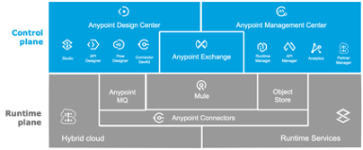
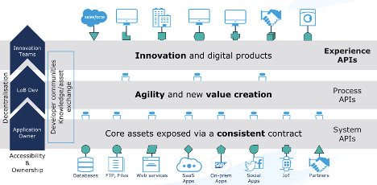
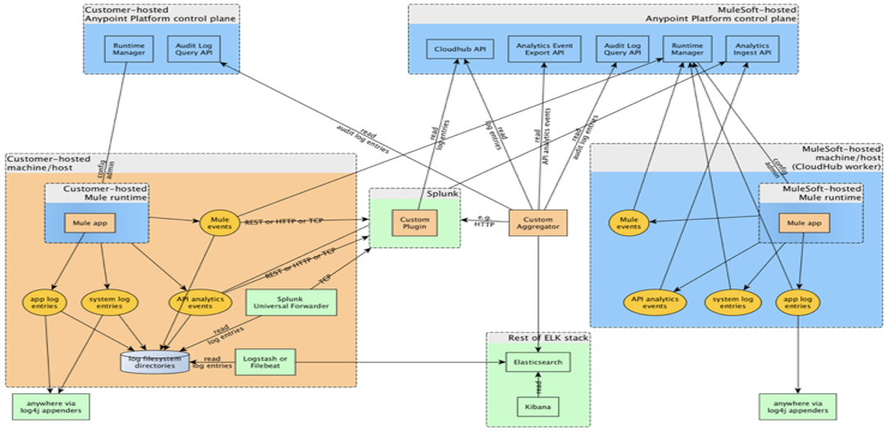
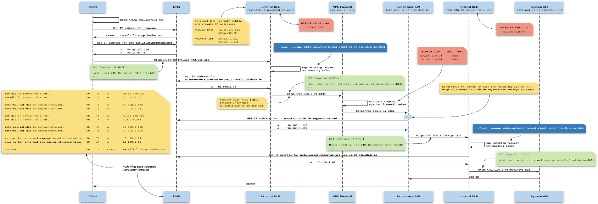

# Anypoint Platform Architecture

Note: document based of https://knowledgehub.mulesoft.com/s/article/Integration-Architecture-Specification

# About this Document

This document presents the reference architecture for Anypoint Platform. The platform components will become the foundational building blocks for current and future API solutions, where MuleSoft will be the primary platform for connectivity.

The document is not intended to provide the solution design and architecture for a particular project or API initiative, this document describes a strategic architecture blueprint of the underlying MuleSoft platform and is intended to provide the foundation for delivering future API solutions.

# Intended Audience

The intended audience for this document comprises the API Leads / Product Owners, Delivery Leads, Enterprise Architects, and Solutions Architects. 

In addition to these roles, it is essential that the Business Teams (Business Analysts, Consultants, and Line of Business IT) are aware of this document and its content, as it describes many activities and processes involved in the delivery of APIs.

# Table of Contents

## Table of Contents

- [About this Document](#about-this-document)
- [Intended Audience](#intended-audience)
- [1. Business and Solution Context](#1-business-and-solution-context)
    - [1.1. Goals and Objectives](#11-goals-and-objectives)
    - [1.2. Solution Context](#12-solution-context)
        - [1.2.1. Key Systems](#key-systems)
    - [1.3. Current State Challenges](#current-state-challenges)
    - [1.4. Integration Architecture Principles](#integration-architecture-principles)
- [2. Anypoint Platform](#anypoint-platform)
    - [2.1. Anypoint Platform Licensed Capabilities](#anypoint-platform-licensed-capabilities)
    - [2.2. Platform Architecture and Setup](#platform-architecture-and-setup)
    - [2.3. Environments Model](#environments-model)
    - [2.4. Infrastructure Setup (CloudHub)](#infrastructure-setup-cloudhub)
    - [2.5. Load Balancing](#load-balancing)
    - [2.6. SSL Endpoint and DNS Configuration](#ssl-endpoint-and-dns-configuration)
    - [2.7. TCP Load Balancer](#tcp-load-balancer)
    - [2.8. Workers](#workers)
    - [2.9. Controllers](#controllers)
    - [2.10. High Availability (HA)](#high-availability-ha)
    - [2.11. Disaster Recovery](#disaster-recovery)
    - [2.12. CloudHub Capability – Key Considerations](#cloudhub-capability-key-considerations)
    - [2.13. Disaster Recovery – Options Considered](#disaster-recovery-options-considered)
- [3. Security Architecture](#security-architecture)
    - [3.1. User Identity Management](#user-identity-management)
    - [3.2. Anypoint User Access Management - Authentication](#anypoint-user-access-management-authentication)
    - [3.3. Anypoint User Access Management – Authorization](#anypoint-user-access-management-authorization)
    - [3.4. Anypoint Teams – Structure and Considerations](#anypoint-teams-structure-and-considerations)
    - [3.5. Platform User Access Management](#platform-user-access-management)
    - [3.6. User Audit](#user-audit)
    - [3.7. API and Application Security](#api-and-application-security)
    - [3.8. API Client Authentication and Authorization](#api-client-authentication-and-authorization)
    - [3.9. Secure Connectivity](#secure-connectivity)
    - [3.10. API Policy Management](#api-policy-management)
    - [3.11. Secure Application Configuration Management](#secure-application-configuration-management)
    - [3.12. Infrastructure Security](#infrastructure-security)
    - [3.13. Firewall Rules](#firewall-rules)
- [4. Application Architecture](#application-architecture)
    - [4.1. API Led Connectivity](#api-led-connectivity)
    - [4.2. Integration Patterns](#integration-patterns)
- [5. Operations Architecture](#operations-architecture)
    - [5.1. Log Management](#log-management)
    - [5.2. Monitoring and Alerting](#monitoring-and-alerting)
    - [5.3. Platform Alerts](#platform-alerts)
- [6. Common Services](#common-services)
    - [6.1. API Implementation Template](#api-implementation-template)
    - [6.2. API Design Template](#api-design-template)
    - [6.3. Error Handling](#error-handling)
    - [6.4. Configuration Management](#configuration-management)
    - [6.5. Secure Properties](#secure-properties)
- [7. Software Development Lifecycle (SDLC)](anypoint-platform-architecture/7-software-development-lifecycle.md)
    - [7.1. Mule Application Development Considerations](anypoint-platform-architecture/7-software-development-lifecycle.md#71-mule-application-development-considerations)
    - [7.2. Version Control Strategy](anypoint-platform-architecture/7-software-development-lifecycle.md#72-version-control-strategy)
    - [7.3. Deployment and Sizing Strategy](anypoint-platform-architecture/7-software-development-lifecycle.md#73-deployment-and-sizing-strategy)
    - [7.4. Development Standards and Naming Conventions](anypoint-platform-architecture/7-software-development-lifecycle.md#74-development-standards-and-naming-conventions)
    - [7.5. Build and Deployment Automation (CICD)](anypoint-platform-architecture/7-software-development-lifecycle.md#75-build-and-deployment-automation-cicd)
    - [7.6. SDLC Tooling Catalog](anypoint-platform-architecture/7-software-development-lifecycle.md#76-sdlc-tooling-catalog)
- [Appendix](#appendix)
    - [Backend Systems Catalog](#backend-systems-catalog)
    - [CloudHub Log Data Externalization Options](#cloudhub-log-data-externalization-options)
    - [Anypoint Team Profiles and Permissions Model](#anypoint-team-profiles-and-permissions-model)
- [About MuleSoft, a Salesforce Company](#about-mulesoft-a-salesforce-company)

## 1. Business and Solution Context

RideXpress is a fictional ride sharing company founded with the solely purpose of demonstrating the power of the API-First approach. It was created with the idea of powering every single API with Anypoint Platform, from the main API to the integration to third party APIs or Applications, every single piece of code runs on a flavor of the Mule Runtime.

RideXpress is completely Open Source and Community driven so we can learn from each other based on our diverse backgrounds and experiences.

### 1.1. Goals and Objectives

- User-Centric Subscription Model: Predictable pricing for drivers with monthly subscription plans.
- Stability for Drivers: Consistent earnings through a steady flow of riders.
- Seamless Experience: Effortless rides without surge pricing worries.
- Tech-Driven Community: Optimized matching and efficient service.
- Disruptive Innovation: A proposal that challenges traditional pay-per-ride models like Uber or Lyft.

### 1.2. Solution Context

<TODO: Describe the current state solution landscape within the customer, the target state architecture, and how MuleSoft will complement, or replace existing integration capabilities as the customer transitions from as-is to to-be state>

#### 1.2.1. Key Systems 

| System | Description | Deployment Model | Key integration concerns |
| --- | --- | --- | --- |
| Salesforce | Customer Management platform to support sales and service activities. | Cloud | MuleSoft connectors available |
| Google Maps | Maps and routes system to support geo location and building the best routes | Cloud | MuleSoft connectors available |
| Okta | Authentication platform to manage users credentials and platform authentication | Cloud | Mulesoft connectors available |
| Square | Payment platform to manage payments of rides | Cloud | REST API Available |
| Gmail | Email plaform to send notifications to users | Cloud | Mulesoft connectors available |
| Apple Push Notification | Push notifications plaform to send notifications to users | Cloud | REST API Available |
| DB System | Database engine to store support information related to rides, users and drivers | Cloud | REST API Available |

### 1.3. Current State Challenges

There are several challenges within the existing IT landscape that create friction and hinder the ability to realize their broader business objectives, including:

1.  Find low/non cost alternatives for the MVP
1.  Understand the regulations of payments
1.  Understand the regulations of personal information 
1.  Being an Open Source company can affect the main interests

### 1.4. Integration Architecture Principles

- **APIs as a product**: Treat every API as a product - effectively every API should be an independent product, with its own lifecycle and ownership. This is one of the core principles which underpins the application network, and effectively drives the vision around the ‘composable’ enterprise, and the goal to increase time to market for new products and propositions.
- **Secure**: Given the critical nature of services that need to be supported, it is essential that security is built from the ground up. This must all elements of the integration, for example 
    - API Security 
    - Data security (in transit and at rest)
    - Operations Security (e.g. proactive monitoring and alerts, audit)
- **Scalable**: Integration services are highly utilized and need to scale to meet growing demand, as well as changing customer behaviors. Solutions built must be scalable, and application and infrastructure design must consider this as a core capability. 
- **Resilient**: Services should be built with resilience and reliability in mind. Where appropriate, asynchronous processing patterns should be considered, with appropriate error management and alerting to support resilient operations. 
- **Measurable**: Services built should have metrics configured to analyze and improve on service delivery. This will help to more proactively identify and manage issues, and capacity going forward. 
- **Discoverable**: All assets should be published to a central repository so that teams can discover and reuse assets to drive new business initiatives and outcomes. 
- **Canonical Data Model**: There must be a canonical data model for each business domain (this does NOT mean having a canonical data model for the whole organization, which would NOT be recommended). Canonical data model must be maintained as a separate reusable RAML fragment documented on Exchange.
- **Loosely coupled, highly cohesive**: APIs and applications should have a single responsibility when it comes to supporting wider business outcomes. This aligns with the API led architecture approach and enables the creation of assets that can be reused and ‘composed’ to drive future capabilities.

### 1.5. Assumptions and Dependencies

<Document key assumptions and dependencies that have been considered as part of this platform architecture definition. > 

- <Assumption / Dependency>

## 2. Architecture Decisions

<Document the key architecture decisions that have been made as part of the platform architecture definition.Please update the below decisions to reflect the platform architecture decisions agreed with the customer. > 

| Id | Decision | Rationale | Implication |
| --- | --- | --- | --- |
| Dxx | <Description of the decision> | <Describe the rationale of the decision – why was this decision made> | <what are the implications of this decision. What should the stakeholders be aware of because of this decision that they are signing up to> |
| D01 | MuleSoft CloudHub control plane will be hosted in the US. | ● Provide the ability to support multiple runtime plane regions as the platform scales – this is only possible with the US control plane, as the EU control plane only supports Frankfurt, and Ireland regions as of Mar/2022.   ● Control plane data is stored in the US. Note that this is limited to API and application meta-data, and CloudHub platform user authentication and authorization data. | |

## 3. Anypoint Platform

The Anypoint Platform has five major components and will be the core to future integration capabilities:
- **Anypoint Design center**: Comprehensive tools to develop APIs and integrations faster and easier
- **Exchange**: Marketplace of API and integration assets, promotes reuse of pre-built connectors, templates, examples, and APIs 
- **Anypoint Management center**: Manage and monitor your applications across the platform in a single place
- **Mule runtime engine & services**: Single runtime for your Mule applications, easily configurable, performant, and deployable anywhere
- **Anypoint MQ**: Anypoint Cloud based messaging platform, to support asynchronous messaging use cases such as queueing and publish-subscribe with fully hosted and managed cloud-based Message Queues and Exchanges
- **Object Store**: Mechanism for storing arbitrary objects in MuleSoft using key-value pairs
- **Security**: Safeguard sensitive information with layers of protection
- **Anypoint Connectors**: Provide a means to connect to endpoints from your integration applications. Connectors fall into different categories.
    - **Community**: MuleSoft or members of the MuleSoft community write and maintain the Community connectors. Connectors built by the community or MuleSoft are generally open-source, although each package may vary. Partner-built connectors may not be open-source. Contact the partner directly for more information. You do not need any special account or license to use a Community connector
    - **MuleSoft Certified**: MuleSoft Certified connectors are developed by MuleSoft’s partners and developer community and are reviewed and certified by MuleSoft. For support, customers should contact the MuleSoft partner that created the MuleSoft Certified connector.
    - **Select**: MuleSoft maintains Select connectors. Connectors included in the open source Mule distribution can be used by everyone, however support is only included in an Anypoint Platform subscription.
    - **Premium**: MuleSoft maintains Premium connectors; you must have an active CloudHub Premium plan or an Enterprise subscription with an entitlement for the specific connector you wish to use.

### 3.1. Anypoint Platform Licensed Capabilities

Current provision of the platform  [Titanium / Platinum / Gold] MuleSoft subscription, with the following license entitlements as of <Jan 1, 2022> 

- **Production Cores/vCores**: <4> 
- **Sandbox Cores/vCores**: <8>
- **Anypoint VPCs**: <4>
- **Anypoint VPNs**: <4>
- **Anypoint DLBs (Dedicated Load Balancer)**: <4>
- **Static IPs**: <8>
- **API Manager and Analytics**
- **Premium Connectors**
- **SAP** [<1> Production, and <2> non-production environments]

**Reference**: [Product Subscription Plans](https://www.mulesoft.com/prod-subscription-plans)

## 4. Platform Architecture and Setup

<Describe the key details of the platform setup with the customer landscape, including details of platform infrastructure considerations like VPCs, DLBs, VPNs > 

The following section describes how the Anypoint platform foundations are architected to support the long-term requirements of the enterprise.
 
_Update diagram based on agreed platform architecture_

### 4.1. Environments Model

Environments are a logical construct within Anypoint. Environments will be created at the business group level. Given the current Route to Live considerations, the minimum set of environments required would be as follows:

| Environment | Description | Classification (vCore) | High Availability? | Deployed By |
| --- | --- | --- | --- | --- |
| TEST | Used for functional and end to end testing | Sandbox | No | DevOps (Manual Approvals) |
| PROD | Production environment | Production | Yes | DevOps (Manual Approvals) |

### 4.2. Infrastructure Setup (CloudHub)

TODO: Infrastructure diagram

 Access from [CUSTOMER] Data Center subnets to Internal CloudHub DLB internal endpoint, or alternatively through use of the mule-worker-internal-* endpoints. |

#### 4.2.1. Load Balancing

Dedicated Load balancers (DLBs) will be used to support load balancing of all MuleSoft hosted applications – both external facing and internal facing APIs. Access to shared load balancer endpoints will be restricted via VPC firewall rules to restrict access exclusively through the DLBs. DLBs also provide High Availability through deployment on two or more workers. This does NOT reduce the number of vCores available on CloudHub. Note that at this stage, the default DLB entitlement of 2 workers will be used, but this can be extended if additional throughput is required (additional DLB entitlements have commercial considerations and will need to be reviewed with the MuleSoft Account Team). 

Two DLBs instances will be configured, 
- External facing DLB to host SSL endpoints to external partners and customers. 
- Internal facing DLB to host internal only SSL endpoints – these will be used for Mule to Mule API connectivity, and internal traffic originating from the corporate Data Center or other trusted network securely connected to CloudHub VPC (e.g. via VPN) 

| DLB Name | VPC Name | Role (e.g. Internal) | Allowlisted CIDRs |
| --- | --- | --- | --- |
| [CUSTOMER]-nonprod-ext-de-c1 | vpc01-nonprod-de-c1 | External | 0.0.0.0/0 |
| [CUSTOMER]-nonprod-int-de-c1 | vpc01-nonprod-de-c1 | Internal | <<Internal corporate CIDRs>> |
| [CUSTOMER]-prod-ext-de-c1 | vpc02-prod-de-c1 | External | 0.0.0.0/0 |
| [CUSTOMER]-prod-int-de-c1 | vpc02-prod-de-c1 | Internal | <<Internal corporate CIDRs>> |

TODO: Complete the table ^

Additional details on CloudHub networking and Dedicated Load Balancers are available [here](https://docs.mulesoft.com/runtime-manager/cloudhub-networking-guide) and [here](https://docs.mulesoft.com/runtime-manager/cloudhub-dedicated-load-balancer) respectively.

#### 4.2.1.1. SSL endpoint and DNS configuration

External Facing Dedicated Load Balancer endpoints

| Environment | Public Endpoint DNS | Certificate Config | CNAME configuration |
| --- | --- | --- | --- |
| DEV | dev.api.[CUSTOMER].com | CA signed certificate | [CUSTOMER]-nonprod-ext-de-c1.lb.anypointdns.net |
| TEST | test.api.[CUSTOMER].com | CA signed certificate | [CUSTOMER]-nonprod-ext-de-c1.lb.anypointdns.net |
| PREPROD | pp.api.[CUSTOMER].com | CA signed certificate | [CUSTOMER]-nonprod-ext-de-c1.lb.anypointdns.net |
| PROD | api.[CUSTOMER].com | CA signed certificate | [CUSTOMER]-prod-ext-de-c1.lb.anypointdns.net |

TODO: Complete the table ^

Internal Facing Dedicated Load Balancer endpoints

| Environment | Public Endpoint DNS | Certificate Config | CNAME configuration |
| --- | --- | --- | --- |
| DEV | dev.api.[CUSTOMER].internal | Internal PKI signed Non-Prod SAN certificate with config for all three non-prod endpoints | [CUSTOMER]-nonprod-int-eu.lb.anypointdns.net |
| TEST | test.api.[CUSTOMER].internal | | [CUSTOMER]-nonprod-ext-eu.lb.anypointdns.net |
| PREPROD | pp.api.[CUSTOMER].internal | | [CUSTOMER]-nonprod-int-eu.lb.anypointdns.net |
| PROD | api.[CUSTOMER].internal | CA signed certificate | [CUSTOMER]-prod-int-eu.lb.anypointdns.net |

TODO: Complete the table ^

Additional details on resolving private domains in a VPC are available [here](https://docs.mulesoft.com/runtime-manager/resolve-private-domains-vpc-task).

##### 4.3.1. TCP Load Balancer
Not applicable at this stage.

##### 4.3.2. Workers 
Not applicable at this stage.

##### 4.3.3. Controllers 
Not applicable at this stage.

### 4.4. High Availability (HA)

CloudHub provides HA and disaster recovery for hardware and application failures by using Amazon AWS as its cloud infrastructure. More details can be found in MuleSoft documentation [here](https://docs.mulesoft.com/runtime-manager/cloudhub-fabric).

From an applications perspective, HA is supported as follows: 
- Both vertical and horizontal scalability is supported. There is an option to either increase the worker size or add more workers for specific application. At a minimum, to ensure HA, CloudHub applications must be deployed to two or more workers – this in turn guarantees deployment of workers across different AWS Availability Zones. 
- Autoscaling is potentially a future state option, however this has commercial implications and will require an upgrade to Enterprise License Agreement (ELA). 
- CloudHub provides zero-downtime deployments to further address availability concerns (Note, zero-downtime deployments do not impact available vCore capacity) 

### 4.5. Disaster Recovery

Several options exist within CloudHub for Disaster Recovery. Defined as the process by which a system is restored to a previous acceptable state, after a natural (flooding, tornadoes, earthquakes, fires, etc.) or human-made (power failures, server failures, misconfigurations, etc.) disaster. MuleSoft uses the Amazon AWS infrastructure to host CloudHub, which in turn provides capabilities to manage Disaster Recovery.

Disaster Recovery will be based on existing CloudHub Availability zone-based DR to support the current state enterprise needs. At this stage, cross-region Disaster Recovery is not considered as a priority given the acceptable risk profile of the default DR capability via Availability Zones. For future reference, the options available for DR are documented in section 4.7.2 

##### 4.5.1. CloudHub capability – key considerations
- CloudHub provides HA and disaster recovery for hardware and application failures by using Amazon AWS as its cloud infrastructure
- From a DR perspective, it is recommended to deploy the CloudHub control plane to a different region to runtime plane - this will enable management and redeployment of runtimes in the case of runtime region failure. For example, customers can configure the control plane in the US-East region, and the runtime plane currently in EU-Central (Frankfurt) region depending on regional considerations (e.g proximity to corporate applications and data).
- Mule applications deployed to multiple CloudHub workers, are deployed across AWS Availability Zones (AZ), which enable better isolation and protection from issues such as power outages, lightning strikes, tornadoes, earthquakes, etc. AZ’s are physically separated by a meaningful distance, many kilometers, from any other AZ, although all are within 100 km (60 miles) of each other

##### 4.5.2. Disaster Recovery – Options considered

- Disaster Recovery using Availability Zones: When MuleSoft applications are deployed to multiple workers, they are automatically distributed across 2 or more availability zones. This provides for availability as well as redundancy in the event of a disaster occurring in one Availability Zone (AZ). Where a Mule application is deployed across AZ’s, the customer is better isolated and protected from issues such as power outages, lightning strikes, tornadoes, earthquakes, etc. AZ’s are physically separated by a meaningful distance, many kilometers, from any other AZ, although all are within 100 km (60 miles) of each other.
- Disaster Recovery across Regions: It is also possible to achieve a greater level of Disaster Recovery protection by deploying Mule applications across multiple regions. This, in turn, will require additional infrastructure, processes, and tooling in place to enable deployments across multiple regions. There are different options that can be considered for Cross-region DR:
    - Cold Standby - The Mule environment is installed and configured. However, the Mule Runtimes are not running and are started after an outage is detected. This will require additional CloudHub components to be provisioned - specifically VPCs, DLBs, VPNs. As vCores will be in an undeployed state, this should not require additional vCores.
    - Warm Standby - The Mule environment is installed, configured, and fully running. However, it is not processing requests until an outage is detected. This will require additional CloudHub components to be provisioned - specifically VPCs, DLBs, VPNs, and vCores ‘in use’.
    - Active-Active - Mule applications are deployed across multiple regions in an active-active setting, with requests being processed by Mule applications across two or more regions. This will require additional CloudHub components to be provisioned - specifically VPCs, DLBs, VPNs, vCores - and will also require an external load balancer to manage traffic routing across the different regions.

Additional details on Amazon AWS infrastructure available [here](https://aws.amazon.com/infrastructure/)

## 5. Security Architecture
*Document the key security architecture details that have been made to ensure the secure setup and operations of the Anypoint Platform within the customer. Please update the below sections as required to reflect the platform setup details.*
TODO: ^

### 5.1. User Identity Management
*Document details of the setup to support User Identity management, including integration with the corporate user directory, and role-based access control considerations using Anypoint Teams and potential integration with AD groups etc.*

For the MVP phase, we will utilize the Anypoint Platform's built-in Identity Provider for User Identity Management. Access control will be managed directly within the Anypoint Platform.

#### 5.1.1. Anypoint User Access Management - Authentication
The Anypoint platform will use the integrated identity solution to for all users accessing the Anypoint platform.

#### 5.1.2. Anypoint User Access Management – Authorization
The Anypoint platform contains a full Role Based access model allowing all users/applications to have specific access to the areas/applications they require, without impinging upon areas which they should not have access to. This includes Business Group [BG] and Environment [ENV] specific access along with 'Anypoint Application' level access. This allows for example, Operational teams to have sole-access to production data, management, monitoring, and analytics data. 

The application of role-based access controls is enabled through Anypoint which allows grouping of users which can easily be configured with permissions into respective Applications, Business Groups and Environments. More information on Anypoint Teams capabilities is available [here](https://docs.mulesoft.com/access-management/teams).

**Note:** Only Organization Administrator permission holders can manage teams within the business group that contains the resources that you want to give a specific user or a team access to. You can modify permissions for all teams in your organization only if you have the Organization Administrator permission over the root organization.

##### 5.1.2.1. Anypoint Teams – structure and considerations
When planning the Anypoint Teams structure, consideration is given to the following:
- Access to the Anypoint platform enables default membership of the “Everyone at RideXPress" team, or the root team.
- The team structure should reflect the structure of enterprise, so that teams and permissions can be planned according to member needs. Note - Teams can be moved as needs change.
- Team names must be unique across the organization.
- Teams can be nested up to 10 levels, including the “Everyone at [CUSTOMER]" team.
- Every child team inherits permissions from its parent team.

TODO: Org diagram

As per the diagram, the preferred structure of Anypoint Teams is to align this to the organization structure defined in Anypoint – specifically via Business groups. This provides for the maximum flexibility and future scale – E.g. The Underwriting team have different API development and operations teams than the Marketing teams for example. Equally, if the same API Developer is used across different parts of the Organization, they can be assigned both roles. 

Specific details on the Anypoint Teams personas and permissions model is documented in [Anypoint Team profiles and permissions model](https://docs.mulesoft.com/access-management/teams#team-permissions).

#### 5.1.3. Platform User Access Management
There are scenarios where platform access will be required to support operational and support activities as part of the management and maintenance of the Anypoint Platform. To facilitate this, Connected Apps will be defined with the relevant scopes to enable access to Anypoint platform capabilities – e.g., CICD processes that require the deployment of APIs and applications to API Manager and Runtime Manager. 

Reference: [Connected Apps](https://docs.mulesoft.com/access-management/connected-apps-overview)

#### 5.1.4. User Audit
Changes made by users within the Anypoint Platform organization are logged through an audit logging service. These can be accessed through the Audit Logging Query API or through the Audit Logging UI of the Control Plane. Audit logs have a retention period of six years. Where additional retention is required, this data can be integrated to external solutions (e.g. SIEM applications).

The audit logging service provides a history of actions performed within the Anypoint Platform. It keeps track of all users who have interacted with objects in the system and timestamps these actions. It also provides mechanisms for querying the set of users who have performed actions, the set of objects that have had actions performed on them, and other endpoints that enable the querying of log entries.

Full details on the audit capabilities are available [here](https://docs.mulesoft.com/access-management/audit-logging).

### 5.2. API and Application Security
<Document details of the setup to support API security concerns including Authentication, authorization and policy-based access controls >

#### 5.2.1. API Client Authentication and Authorization 
API authentication will use the out of the box Client Validation policies that are available out of the box. Should OAuth 2.0 based use cases need to be supported in the future, API Client management can be configured to support this then. 

For additional information on external client management options and considerations, please review the [MuleSoft documentation](https://docs.mulesoft.com/api-manager/2.x/external-client-apps).

#### 5.2.2. Secure Connectivity
To enable secure connectivity, the following security capabilities will be implemented as part of inbound and outbound API communications. 

| Decision | HTTP/S | Mutual TLS | Firewall rules - E.g. Allow Lists | Other |
| --- | --- | --- | --- | --- |
| Public applications connecting to Mule public facing APIs | Yes | Yes | No specific rules | N/A |
| Mule APIs connecting to each other | Yes | No | No specific rules | N/A |
| Mule APIs consuming internal APIs hosted within the corporate infrastructure, or cloud / SAAS offerings | Dependent on capability/ requirement of downstream application | Dependent on capability/ requirement of downstream application | No specific rules | N/A |
| Internal applications connecting to Mule APIs | Yes | No | No specific rules | N/A |

#### 5.2.3. API policy management
Every single API must be assigned to the security category based on the table below and all the policies defined for the category must be applied against the API. The table also contains the references to MuleSoft documentation of each policy.

Reference: [Policies for Mule 4](https://docs.mulesoft.com/api-manager/2.x/policies-landing-page#mule4)

| Security | Details |
| --- | --- |
| Category | Level A |
| Description | APIs exposing highly sensitive data and capability, exposed over the internet. The abuse of API would have a critical impact on the business. E.g. leak of personal details, unauthorized updates of transactional data, etc. |
| API Criteria | APIs with access to customer or other sensitive data, exposed externally over the internet. |
| Use Case | Create Policy, Create Claim, Change Policy |
| API Layer | Experience APIs |
| Patterns | ● JWT Token Validation / OAuth 2.0 Token Enforcement (required API Client Management configuration)   ● All the patterns of Level B |
| Useful Links | [JWT Token Validation](https://docs.mulesoft.com/api-manager/2.x/policy-mule4-jwt-validation#policy-configuration) |

| Security | Details |
| --- | --- |
| Category | Level B |
| Description | APIs with the standard, minimum level of security. The APIs are essential for day to day business activities but do NOT transfer/read sensitive data. These APIs are exposed only to internal API consumers and can be considered east-west traffic – either other Mule APIs or customer internal APIs via secure connectivity (e.g. VPNs) |
| API Criteria | All APIs consumed within the trust boundary of the organization. |
| Use Case | Availability |
| API Layer | Experience, Process, System |
| Patterns | ● Client ID Enforcement   ● Spike Control (based on specific API throughput considerations)   ● CORS (Experience APIs exposed to web clients only)   ● JSON Threat Protection |
| Useful Links | [Client ID Enforcement](https://docs.mulesoft.com/api-manager/2.x/client-id-based-policies)   [Spike Control](https://docs.mulesoft.com/api-manager/2.x/spike-control-reference)   [CORS](https://docs.mulesoft.com/api-manager/2.x/cors-policy)   [JSON Threat Protection](https://docs.mulesoft.com/api-manager/2.x/apply-configure-json-threat-task) |

#### 5.2.4. Secure Application configuration Management 
All sensitive passwords and data in property files will be encrypted using the secure properties placeholder with a key that will be injected as part of the build process. This will ensure that secure properties are not stored in clear text in the source code repository. 

A process will need to be agreed by the C4E team to support the encryption of secure properties, so that the encryption keys are not available to all developers. Additional details around configuration management is captured in the section Configuration Management

Reference: [Secure Configuration Properties](https://docs.mulesoft.com/mule-runtime/4.3/secure-configuration-properties)

### 5.3. Infrastructure Security
CloudHub provides a secure platform for the deployment of MuleSoft APIs and integrations. Security and compliance details of the CloudHub platform are published [here](https://www.mulesoft.com/platform/cloudhub-ipaas-cloud-based-integration).

In addition to the platform security, the following additional measures have been put in place to safeguard applications deployed in CloudHub.

#### 5.3.1. DLB Security 
All API access will be managed via DLBs. Routing rules will be configured at the DLB level to allow routing of API traffic to external facing APIs only. Internal-facing APIs will be accessible only to internal DLBs (restricted to traffic originating within MuleSoft VPCs or corporate data center(s) securely connected to CloudHub via VPN. 

A more detailed view of the traffic flow between API consumers, and the DLBs (external and internal) is provided in the sequence diagram in Appendix A3. CloudHub DLB Detailed Connectivity Flow

#### 5.3.2. Firewall Rules
VPC firewall rules will be configured to restrict traffic to internally originating traffic only, i.e. traffic originating within the VPC itself, or traffic originating from the corporate data center(s) which is securely connected to the CloudHub VPC via VPN. 

## 6. Application Architecture
This section is a drill down of the Platform Architecture, covering the application related components and their interactions.

### 6.1. API Led Connectivity

The key goal of the approach recommended by this document is to introduce reusable building blocks that can be reused both during the initial implementation and by future projects, resulting in reduced development effort.

API-led connectivity is a methodical way to connect data to applications through a series of reusable and purposeful modern APIs that are each developed to play a specific role – unlock data from systems, compose data into processes, or deliver an experience.

The API building block is a product that consists of functionality and simplicity required for the full lifecycle of APIs. This lifecycle consists of the ability to compose the data and connect to any other source of data. And it must provide full visibility, security, governance right from design.

The diagram below illustrates the API-led connectivity approach composed of three main layers:
- System APIs to unlock backend systems through a consistent contract, making use of our extensive connectivity, 
- Process APIs providing orchestration and transformation into business domain objects for greater agility and value creation and 
- Experience APIs focused on rendering information specific to devices or consuming client applications.

The value of this approach is enabling a flexible, agile architecture built for reuse and consumption, to speed up project delivery with built in governance and security.

### 6.2. Integration Patterns
Based on the discussions and discovery sessions, the following integration patterns were identified:

| Pattern | Description | Examples |
| --- | --- | --- |
| Real time, Synchronous | Real time or near real time requests to retrieve or process data, or trigger business processes, where the requester requires immediate feedback to support the scenario. | ● Address Verification   ● Policy Number Generation |
| Async - Fire and Forget | Async, near real time, Fire and Forget type scenarios where API clients send messages but do not need to wait for a response as part of their processes. | ● Policy Creation (async UW validation, core setup etc.)   ● Claim creation (rules processing, etc.) |

## 7. Operations Architecture
<Document details of the platform setup to support the operational management and maintenance of the platform>

The Anypoint platform provides different capabilities to support the operational aspects of managing and maintaining API and applications deployed to the MuleSoft platform.

### 7.1. Log Management
<Document details specific to log management, specifically in terms of log integration with third party tools, considerations around log retention within the platform etc. >

Mule applications will use a standard logging framework to ensure log data is captured consistently across Mule applications, with the right structure and data points to support effective troubleshooting. 

All application logs within Mule applications will be integrated with the corporate logging solution. This will enable log aggregation between multiple Mule apps (e.g. Experience, Process and System APIs) and other systems where applicable. Data will be pushed from MuleSoft to ELK via Log4J Socket appender configurations. For more information on options to integrate MuleSoft application log data to external applications, see Appendix A2. CloudHub Log data externalization options

Note that logs will not exclusively be pushed to ELK, and that these will also be available within the Anypoint platform – this is to facilitate MuleSoft support processes which require access to the logs as part of troubleshooting and supporting the delivery teams where required. 

Details on Custom Log4J configurations, including CloudHub settings to enable custom Log4J configurations are available here. 

### 7.2. Monitoring and Alerting
<Document details specific to monitoring and alerting capabilities and how this will be setup - both in terms of utilizing Anypoint platform capabilities, as well as external enterprise tooling where appropriate and how the platform data will be made available to these tools >

The Anypoint platform supports the following monitoring capabilities as part of the TITANIUM subscription. Depending on the relevant use cases and operational needs of the use case, one or more of the capabilities listed below can be configured as part of the use case implementation. 
- API / Application alerts - 
    - Alerts on API events (e.g. API errors)
    - Custom application alerts using CloudHub Notifications
    - If log aggregation to external tools, capability within the tooling can be leveraged to support advanced alerting use cases
- Anypoint Monitoring dashboards
    - Out of the box dashboards available for APIs and applications
    - Custom dashboards can be configured to consolidate information for operational / governance purposes 
- Anypoint Visualizer 
    - Troubleshooting and governance of application network
- Functional monitors 
    - Proactive health checking and alerting - can be used with implementation health check configurations

Additional Details: [Anypoint Monitoring Overview](link)

### 7.3. Platform Alerts
At a platform level, alerts should be configured when ARM encounters a problem with a Server or Server Cluster. These settings can be set at a global level, meaning for all APIs deployed to the Business Groups. At minimum, the following conditions should be monitored:

| Source/Server type | Condition | Severity Level | Config details |
| --- | --- | --- | --- |
| Application | CPU Usage | Critical | >=80% for at least 10 mins |
| Application | Deployment failed | Warning | NA |
| Application | Memory Usage (depends on worker size) | Critical | >=80% for at least 10 mins |
| Application | Worker not responding | Critical | NA |

Guidance for alert creation:
- Alert Naming Convention: 
    - `<source-type>-<application type>-<condition>`
    - Sample: `App-CloudHub-Deployment-Failed`
Notes:
- Naming convention is aligned to the key three input parameters that define the alert (i.e. source-type, application-type, condition).
- Name is used only for providing a reference of the to the alert configuration and used for listing here. 

Guidance for Alert Notification Subject creation: 
- Subject (naming convention):  
    - `${severity}: [CUSTOMER] Anypoint Alert (<env>) - default subject header>` 
where `<env>` is DEV, TEST, PREPROD or PROD. 
    - Sample: `HIGH: [CUSTOMER] Anypoint Alert (PROD) - Deployment Failed`
    - Note:  The use of this prefix is IMPORTANT to ensure email subject header is readily identifiable in a recipient’s inbox since there are no means to use properties or parameters to describe the environment where the issue originates from. This can also support future email-based integrations to Service Management tools (E.g. Service Now) 

For more information on ARM Alerts, refer to the following [Link](link).
Additional References: [Configure Alerts](link)

## 8. Common Services
<Provide details of common services that will be configured to standardize and streamline Mule application development and delivery>

### 8.1. API Implementation Template
To support and streamline application development, API templates will be published for consistent and streamlined development activity. 

These templates encapsulate the key standards, and structures to be used as part of development. Key elements included in the API template:
- Standard structure of Mule Application files – including global configurations, API interface and implementation files
- Structure and placeholders for common, and environment specific properties, including secure properties. 
- Standard maven POM structure, including Parent POM and related configurations
- CICD structure.
- Error handling configurations (utilizing common error handler framework) 
- Health Check framework (which can be integrated with Anypoint Functional Monitoring) 
- Logging standards and configurations

The following API templates have been published to Anypoint Exchange, and aligned to the Repository creation process: 
| Name | Link | When to use? |
| --- | --- | --- |
| mule4-rest-api-template | [<<LINK>>](link) | Use this template to support the development of REST APIs. |
| mule4-anypoint-mq-consumer-template | [<<LINK>>](link) | Use this template to support the development of Anypoint MQ Consumer Application. |
| mule4-batch-template | [<<LINK>>](link) | Use this template to support the development of Batch applications. This template contains common aspects of Batch application development, including:   - Batch framework and common configuration placeholders (e.g. schedulers)   - Framework to support custom alerts, in conjunction with Alert Utility application. See below for details. |

### 8.2. API Design Template
API Design Templates provide a starting point for the consistent structure and design of MuleSoft API specifications based on RAML. The API design template contains the following to support a consistent design approach: 
- Standard structure for API Design Artifacts
- Incorporation of common traits (published separately as common-traits-library). These provide for common handling of the following API aspects
    - API Authentication related headers
    - API Error handling structures and example content
    - API health checks
    - Standard design of common API functions – e.g. Pagination
The API design template is published the Anypoint Exchange and can be imported as part of new API creation in Anypoint Design Center: [<<LINK TO API DESIGN TEMPLATE>>](link)

### 8.3. Error Handling
A common Error handler library has been configured to support consistent error handling approaches as part of MuleSoft projects. The library leverages existing Mule error handling capabilities and builds on this to provide a framework for the management for errors in Mule APIs and applications. 

The library includes default error handling logic for common error scenarios (e.g., standard HTTP errors) and the flexibility to support more bespoke error handling requirements. 

A detailed view of the error handler library, including guidelines on how to implement this as part of Mule API implementations is available [<<HERE>>](link)

### 8.4. Configuration Management
Mule applications typically need specific configurations properties to support implementations. These can be split into the following categories:
- Standard configuration properties – e.g. API endpoints. 
- Secure configuration properties – e.g. API/DB credentials

Properties can further be typically classified as common or environment agnostic properties, or environment specific properties. Common properties should be managed in a separate properties file vs. environment specific properties, to avoid repetition.

The API template will be defined the structure and placeholders for Mule API and application configuration management in line with best practice to manage common properties, environment specific properties and secure properties. 

#### 8.4.1. Secure properties
- MuleSoft provides a secure property placeholder component to enable the encryption of secure properties using a private key. These can then be stored in an encrypted form in the codebase, which in turn is used to build the application and leveraged at runtime. Additional details available [here](link)
    - The secure property key needs to be updated to the CI/CD variable at the project level - and this needs to be done for each environment that the application is deployed to.
    - Note the underlying process and ownership of managing and encrypting secure properties will need to be agreed as part of the broader development and operations process. 
- Every API deployed on CloudHub must use safely hidden properties for sensitivity attributes like credentials. CloudHub supports safely hidden application properties, where the name of a property is visible in the console, but the value is not displayed or retrievable by any user. CloudHub resolves the property at runtime without exposing the sensitive information. More details available [here](link).

    ## A. Appendix
    ### A.1. Backend Systems Catalog

    | System name | Location | Access Protocol | Host | Access |
    | --- | --- | --- | --- | --- |
    | Salesforce - sandbox - partial | Cloud | HTTPS | https://my.salesforce.com | Integration user |
    | Salesforce - sandbox - full | Cloud | HTTPS | TBD | Integration user |
    | Salesforce - production | Cloud | HTTPS | TBD | Integration user |
    | Workday - sandbox | Cloud | HTTPS | wd5-impl-services1.workday.com | Integration user |
    | Workday - production | Cloud | HTTPS | TBD | Integration user |

    ### A.2. CloudHub Log data externalization options

    

    ### A.3. CloudHub DLB Detailed Connectivity Flow

    

    ### A.4. Anypoint Team profiles and permissions model

    | #.# | Team | Description |
    | --- | --- | --- |
    | | Everyone at [CUSTOMER] | Root level Team which all subsequent teams will inherit. Assign view only to users who would like to explore the Anypoint platform and discover assets within Anypoint Exchange. Note: This can be limited in case confidential assets exist within a specific Business Group |
    | 1 | C4E | Core C4E team. Assign C4E users who want read-only permissions across the Anypoint platform (All Business Groups) and the ability to contribute to the documentation within Exchange. This includes access to Design Center, and View permissions to API manager, Anypoint MQ, Runtime Manager, and Anypoint Monitoring. |
    | 1.1 | C4E Platform Administrators | C4E platform administrators. Assign users who have global administrator access to the platform, from management of infrastructure and administration of wider aspects of the platform. This includes administration and management access to API manager, Runtime manager, Anypoint MQ, Anypoint Monitoring, including Org Administrator permissions. This Team should be limited in access – e.g., assigned to core C4E Platform Lead |
    | 1.2 | C4E Platform Engineers | C4E platform engineers. Assign users who are responsible for the technical management and evolution of the Platform. This includes the ability to manage and support the configuration of the platform infrastructure through Runtime Manager (e.g. creation and configuration of VPC, VPN, DLBs) and administrator level access to Anypoint Monitoring, Visualizer and Exchange |
    | 2 | Business Group Teams (E.g. [CUSTOMER] Central IT) | Business group team. Assign business and project users who need to view Exchange assets, and review API and application metrics via Anypoint Monitoring within the specific business group. |
    | 2.1 | Development Team | Development team for a specific business group. Assign to business unit specific development teams. This team will have permissions to support the following: Contribute assets and documents to Exchange. Design APIs in Design Center. Manage APIs in API Manager, Anypoint MQ and Runtime Manager in DEV. Support troubleshooting activities in TEST, PREPROD activities via read only permissions to API Manager, Anypoint MQ and Runtime Manager. |
    | 2.2 | Business Analysis Team | Business Analysis Team for a specific business group. Assign to members who need to review and collaborate on API specifications and documentation in Exchange. |
    | 2.3 | Test Team | Test Team for a specific business group. Assign to members who support testing activities of Mule APIs and applications. This team will need the ability to view and manage aspects of applications in non production environments – E.g. ability to view and manage queues, manage schedules in Runtime Manager (for batch applications) and view application logs. |
    | 2.4 | Business Support and Operations | Operations Team for a specific business group. Assign to business unit specific operational users who need to analyse and troubleshoot issues aligned to the business group, including support analyst who are responsible for L1 and L2 support of the platform. This role will need to permissions for the following: Ability to view API configurations in API Manager in preprod and production environments. Ability to view Runtime Manager configurations in preprod and production environments. Ability to view messaging assets in Anypoint MQ. |
    | 2.5 | Group Administrators | Administrators for a specific business group. Assign to business unit specific administrators to manage configuration of business group, including managing permissions and users within the business group. |
    | 3 | Global Support and Operations | Central Support and Operations Team. Assign to Central support and operations teams |
    | 3.1 | Support Analysts | Shared Services and Support Analysts across the organization. Assign to support analysts who are responsible for L1 and L2 support of the platform, in a shared services model. This role will need to permissions for the following: Ability to view API configurations in API Manager in preprod and production environments. Ability to view Runtime Manager configurations in preprod and production environments. Ability to view messaging assets in Anypoint MQ. |
    | 3.2 | Release Managers | Central Release Management Team. Assign to the release management team who will be responsible for managing Mule application related releases. Ability to manage API configurations in API Manager in preprod and production environments. Ability to manage Runtime Manager configurations in preprod and production environments. Ability to manage messaging assets in Anypoint MQ. |

    ## About MuleSoft, a Salesforce company

    MuleSoft, provider of the world’s #1 integration and API platform, makes it easy to connect data from any system – no matter where it resides – to create connected experiences, faster. Thousands of organizations across industries rely on MuleSoft to realize speed, agility and innovation at scale. For more information, visit [https://www.mulesoft.com](https://www.mulesoft.com).

    MuleSoft is a registered trademark of MuleSoft, LLC, a Salesforce company. All other marks are those of respective owners.
