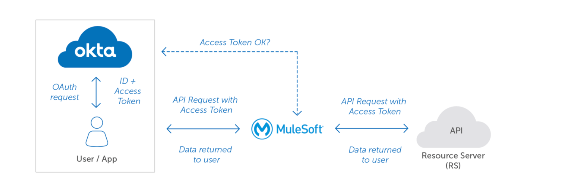

# Security Architecture

- [Security Architecture](#security-architecture)
    - [User Identity Management](#user-identity-management)
        - [Anypoint User Access Management - Authentication](#anypoint-user-access-management-authentication)
        - [Anypoint User Access Management – Authorization](#anypoint-user-access-management-authorization)
            - [Anypoint Teams – structure and considerations](#anypoint-teams-structure-and-considerations)
    - [Platform User Access Management](#platform-user-access-management)
    - [User Audit](#user-audit)
- [API and Application Security](#api-and-application-security)
    - [API Client Authentication and Authorization](#api-client-authentication-and-authorization)
    - [Secure Connectivity](#secure-connectivity)
    - [API policy management](#api-policy-management)

## Security Architecture
### User Identity Management
For the MVP phase, we will utilize the Anypoint Platform's built-in Identity Provider for User Identity Management. Access control will be managed directly within the Anypoint Platform for the Anypoint Platform users.

For the users of the RideXPress platform, Okta will be the Identity Provider. Users will be created in that platform and will use a native token for the Mobile App [here](https://developer.okta.com/docs/guides/configure-native-sso/main/) and an on behalf token [here](https://developer.okta.com/docs/guides/set-up-token-exchange/main/) to talk with the APIs.

#### Anypoint User Access Management - Authentication
The Anypoint platform will use the integrated identity solution to for all users accessing the Anypoint platform.

#### Anypoint User Access Management – Authorization
The Anypoint platform contains a full Role Based access model allowing all users/applications to have specific access to the areas/applications they require, without impinging upon areas which they should not have access to. This includes Business Group [BG] and Environment [ENV] specific access along with 'Anypoint Application' level access. This allows for example, Operational teams to have sole-access to production data, management, monitoring, and analytics data. 

The application of role-based access controls is enabled through Anypoint which allows grouping of users which can easily be configured with permissions into respective Applications, Business Groups and Environments. More information on Anypoint Teams capabilities is available [here](https://docs.mulesoft.com/access-management/teams).

**Note:** Only Organization Administrator permission holders can manage teams within the business group that contains the resources that you want to give a specific user or a team access to. You can modify permissions for all teams in your organization only if you have the Organization Administrator permission over the root organization.

##### Anypoint Teams – structure and considerations
When planning the Anypoint Teams structure, consideration is given to the following:
- Access to the Anypoint platform enables default membership of the “Everyone at RideXPress" team, or the root team.
- The team structure should reflect the structure of enterprise, so that teams and permissions can be planned according to member needs. Note - Teams can be moved as needs change.
- Team names must be unique across the organization.
- Teams can be nested up to 10 levels, including the “Everyone at RideXPress" team.
- Every child team inherits permissions from its parent team.

As per the diagram, the preferred structure of Anypoint Teams is to align this to the organization structure defined in Anypoint – specifically via Business groups. This provides for the maximum flexibility and future scale – E.g. The Underwriting team have different API development and operations teams than the Marketing teams for example. Equally, if the same API Developer is used across different parts of the Organization, they can be assigned both teams. 

Specific details on the Anypoint Teams personas and permissions model is documented in [Anypoint Team profiles and permissions model](https://docs.mulesoft.com/access-management/teams#team-permissions).

#### Platform User Access Management
There are scenarios where platform access will be required to support operational and support activities as part of the management and maintenance of the Anypoint Platform. To facilitate this, Connected Apps will be defined with the relevant scopes to enable access to Anypoint platform capabilities – e.g., CICD processes that require the deployment of APIs and applications to API Manager and Runtime Manager. 

Reference: [Connected Apps](https://docs.mulesoft.com/access-management/connected-apps-overview)

#### User Audit
Changes made by users within the Anypoint Platform organization are logged through an audit logging service. These can be accessed through the Audit Logging Query API or through the Audit Logging UI of the Control Plane. Audit logs have a retention period of six years. Where additional retention is required, this data can be integrated to external solutions (e.g. SIEM applications).

The audit logging service provides a history of actions performed within the Anypoint Platform. It keeps track of all users who have interacted with objects in the system and timestamps these actions. It also provides mechanisms for querying the set of users who have performed actions, the set of objects that have had actions performed on them, and other endpoints that enable the querying of log entries.

Full details on the audit capabilities are available [here](https://docs.mulesoft.com/access-management/audit-logging).

### API and Application Security

#### API Client Authentication and Authorization 
API authentication will use OAuth 2.0 with Okta as the Client provider and Users Identity provider. 
Clients can be administrated with Anypoint Platform when using the OpenId configuration.

Users will call Experience API using a On-Behalf-Of Token in combination of the Mobile Client App client registration.

Reference: https://developer.okta.com/docs/guides/set-up-token-exchange/main/

For additional information on external client management options and considerations, please review the [MuleSoft documentation](https://docs.mulesoft.com/access-management/configure-client-management-openid-task).

#### Secure Connectivity
To enable secure connectivity, the following security capabilities will be implemented as part of inbound and outbound API communications. 

| Decision | HTTP/S | Mutual TLS | Firewall rules - E.g. Allow Lists | Other |
| --- | --- | --- | --- | --- |
| Public applications connecting to Mule public facing APIs | Yes | Yes | No specific rules | N/A |
| Mule APIs connecting to each other | Yes | No | No specific rules | N/A |
| Mule APIs consuming internal APIs hosted within the corporate infrastructure, or cloud / SAAS offerings | Dependent on capability/ requirement of downstream application | Dependent on capability/ requirement of downstream application | No specific rules | N/A |
| Internal applications connecting to Mule APIs | Yes | No | No specific rules | N/A |

#### API policy management
Every single API must be assigned to the security category based on the table below and all the policies defined for the category must be applied against the API. The table also contains the references to MuleSoft documentation of each policy.

Reference: [Policies for Mule 4](https://docs.mulesoft.com/api-manager/2.x/policies-landing-page#mule4)

| Security | Details |
| --- | --- |
| Category | Level A |
| Description | APIs exposing highly sensitive data and capability, exposed over the internet. The abuse of API would have a critical impact on the business. E.g. leak of personal details, unauthorized updates of transactional data, etc. |
| API Criteria | APIs with access to customer or other sensitive data, exposed externally over the internet. |
| API Layer | Experience APIs |
| Patterns | OAuth 2.0 Token Enforcement (required API Identity Management configuration)   ● All the patterns of Level B   mTLS with Mobile App|
| Useful Links | [JWT Token Validation](https://docs.mulesoft.com/api-manager/2.x/policy-mule4-jwt-validation#policy-configuration) |

| Security | Details |
| --- | --- |
| Category | Level B |
| Description | APIs with the standard, minimum level of security. The APIs are essential for day to day business activities but do NOT transfer/read sensitive data. These APIs are exposed only to internal API consumers and can be considered east-west traffic – either other Mule APIs or customer internal APIs via secure connectivity (e.g. VPNs) |
| API Criteria | All APIs consumed within the trust boundary of the organization. |
| API Layer | Experience, Process, System |
| Patterns |  ● JWT Token Validation / OAuth 2.0 Token Enforcement (required API Client Management configuration)   ● Spike Control (based on specific API throughput considerations)   ● JSON Threat Protection |
| Useful Links | [Client ID Enforcement](https://docs.mulesoft.com/api-manager/2.x/client-id-based-policies)   [Spike Control](https://docs.mulesoft.com/api-manager/2.x/spike-control-reference)   [JSON Threat Protection](https://docs.mulesoft.com/api-manager/2.x/apply-configure-json-threat-task) |

#### Secure Application configuration Management 
All sensitive passwords and data in property files will be encrypted using the secure properties placeholder with a key that will be injected as part of the build process. This will ensure that secure properties are not stored in clear text in the source code repository. 

A process will need to be agreed by the C4E team to support the encryption of secure properties, so that the encryption keys are not available to all developers. Additional details around configuration management is captured in the section Configuration Management

Reference: [Secure Configuration Properties](https://docs.mulesoft.com/mule-runtime/4.3/secure-configuration-properties)

### Infrastructure Security
CloudHub provides a secure platform for the deployment of MuleSoft APIs and integrations. Security and compliance details of the CloudHub platform are published [here](https://www.mulesoft.com/platform/cloudhub-ipaas-cloud-based-integration).

In addition to the platform security, the following additional measures have been put in place to safeguard applications deployed in CloudHub.

#### DLB Security 
All API access will be managed via DLBs. Routing rules will be configured at the DLB level to allow routing of API traffic to external facing APIs only. Internal-facing APIs will be accessible only to internal DLBs (restricted to traffic originating within MuleSoft VPCs or corporate data center(s) securely connected to CloudHub via VPN. 

A more detailed view of the traffic flow between API consumers, and the DLBs (external and internal) is provided in the sequence diagram in Appendix A3. CloudHub DLB Detailed Connectivity Flow

#### Firewall Rules
VPC firewall rules will be configured to restrict traffic to internally originating traffic only, i.e. traffic originating within the VPC itself, or traffic originating from the corporate data center(s) which is securely connected to the CloudHub VPC via VPN. 