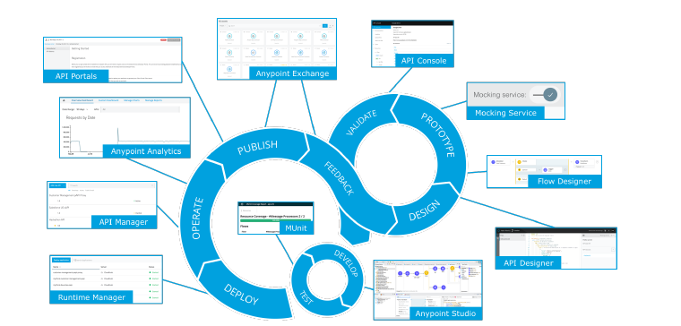

# Software Development Lifecycle

- [7 Software Development Lifecycle (SDLC)](#7-software-development-lifecycle.md)
    - [7.1 Mule Application Development Considerations](#71-mule-application-development-considerations)
    - [7.2 Version Control Strategy](#72-version-control-strategy)
    - [7.3 Deployment and Sizing Strategy](#73-deployment-and-sizing-strategy)
    - [7.4 Development Standards and Naming Conventions](#74-development-standards-and-naming-conventions)
        - [7.4.1 Maven Artifact Id](#741-maven-artifact-id)
        - [7.4.2 Cloudhub domain](#742-cloudhub-domain)
        - [7.4.3 API version](#743-api-version)
        - [7.4.4 API Resources organization](#744-api-resources-organization)
        - [7.4.5 API Methods](#745-api-methods)
        - [7.4.6 API body format](#746-api-body-format)
        - [7.4.7 API pagination and filtering](#747-api-pagination-and-filtering)
        - [7.4.8 Files names](#748-files-names)
        - [7.4.9 Flow names](#749-flow-names)
        - [7.4.10 Dataweave files](#7410-dataweave-files)
        - [7.4.11 Connector configuration names](#7411-connector-configuration-names)
        - [7.4.12 Log files](#7412-log-files)
        - [7.4.13 API, Maven and Cloudhub matching](#7413-api-maven-and-cloudhub-matching)
    - [7.5 Build and Deployment Automation (CI/CD)](#75-build-and-deployment-automation-cicd)
    - [7.6 SDLC Tooling Catalog](#76-sdlc-tooling-catalog)

## 7 Software Development Lifecycle (SDLC)

The following section describes the process and phases of the Software Development Life Cycle of a Mule application/API, the tooling and mechanisms used as part of it.



| Phase | Description |
| --- | --- |
| Discovery | Gather information related to specific needs of a defined story (GitHub issues). Research the available APIs in Exchange. Identify the domain. |
| Design | Design the RAML in Design Center. |
| Prototype and Validate | Validate the API specification is aligned to API consumer expectations through the use of the API mocking tools to enable API consumers to interact with the API specification. |
| Development / Implementation | Using Anypoint Studio and/or Anypoint Code Builder and reusing any available common service (e.g. json-logger) <br> - Unit Testing (local): <br> - Push source code to Version Control System <br> - Run build and deployment automation tasks based on agreed and configured CI/CD processes. |
| Operate/Monitor | Using out of the box features included as part of Anypoint Monitoring to support the operational management and maintenance of the platform. |

## 7.1 Mule Application Development Considerations

- **Version Control tooling**: All Mulesoft code will be stored and managed in GitHub.
- **Repository Strategy**: We'll pick a monorepo to store all the MuleSoft-related code. This approach will bring some advantages that can be found [here](https://semaphoreci.com/blog/what-is-monorepo). APIs or Integrations will be related to one system of records per System API i.e. okta-system-api, salesforce-sytem-api, google-maps-system-api. One Process API per use case. i.e. request-ride-process-api, accept-ride-process-api, finish-ride-process-api, etc. And one Experience API per consumer platform. i.e. mobile-experience-api.
- **Branching strategy**: We'll follow the widely known [Git flow](https://www.gitkraken.com/learn/git/git-flow) which consists in keeping the latest stable code in the main branch and adding new features from feature branches that are mapped to user stories (GitHub issues). Merging changes into the main branch will require a core review and approval from at least 1 team member.

## 7.2 Version Control Strategy

The development team will follow the [Semantic Versioning](https://semver.org) and the Apache Maven conventions.

From SemVer we'll take the following convention:

Given a version number MAJOR.MINOR.PATCH, increment the:

- **MAJOR** version when you make incompatible API changes
- **MINOR** version when you add functionality in a backward compatible manner
- **PATCH** version when you make backward compatible bug fixes

From Maven we'll make use of **SNAPSHOT** versions that are extremely handy for ongoing development.

- **okta-system-api-1.0.0-SNAPSHOT** is a version that is under development
- **okta-system-api-1.0.0** is a release version

## 7.3 Deployment and Sizing Strategy

For the MVP all the applications will use the minimum capacity

| Worker Size | Worker Memory | Heap Memory | Disk Storage Size |
| --- | --- | --- | --- |
| 0.1 vCores | 1 GB | 500 MB | 8 GB |

Workers with 0.1 vCores and 0.2 vCores:
- Provide limited CPU and I/O for apps with smaller workloads
- Can burst to higher CPU speeds for a short time
- This ability helps to improve application startup times and to process infrequent, large workloads. If you need consistent performance, use workers with more vCores.

| Mule Runtime Version |
| --- |
| 4.6.1 |

[Reference](https://docs.mulesoft.com/cloudhub/cloudhub-architecture#cloudhub-workers)

## 7.4 Development Standards and Naming Conventions

All APIs and applications implemented in MuleSoft and deployed to CloudHub will need to adhere to development standards and guidelines, including naming conventions. Consistent standards and naming conventions support maintainability, discoverability and contribute to better quality code. This in turn helps drive reuse and pace of change, and help to reduce technical debt in the future.

### 7.4.1 Maven Artifact Id

Full names are favored to improve readability.

Examples:
```
ridexpress-mobile-experience-api
salesforce-system-api
okta-system-api
```

### 7.4.2 Cloudhub domain

Cloudhub follows the `https://{application_name}.shard.usa-w2.cloudhub.io` convention with a maximum length of 42 characters and names should be unique for the whole cloudhub.io domain.

For RideXpress we'll adopt the following convention:
```
https://ridexpress-{environment}-{api_name_short_name}.shard.{region}.cloudhub.io/{api_version}/{api_resources}

https://ridexpress-sandbox-mobile.shard.usa-w2.cloudhub.io/v1
https://ridexpress-sandbox-salesforce.shard.usa-w2.cloudhub.io/v1
https://ridexpress-sandbox-okta.shard.usa-w2.cloudhub.io/v1
https://ridexpress-prd-mobile.shard.usa-w2.cloudhub.io/v1
https://ridexpress-prd-salesforce.shard.usa-w2.cloudhub.io/v1
https://ridexpress-prd-okta.shard.usa-w2.cloudhub.io/v1
```

### 7.4.3 API version

We'll follow the `v1, v2, v{n}` standard

Versions will be updated only when changes are not backward compatible.  

### 7.4.4 API Resources organization

API resources should be aligned with business resources and should follow the most common REST API standard:

```
/{resources}/{resource_id}
users/123456
rides/123456
contacts/12345
contacts?address=123 Main
```

### 7.4.5 API Methods

HTTP Methods should be used according the following convention:

**GET:** The GET method requests a representation of the specified resource. Requests using GET should only retrieve data.  
**HEAD:** The HEAD method asks for a response identical to a GET request, but without the response body.  
**POST:** The POST method submits an entity to the specified resource, often causing a change in state or side effects on the server.  
**PUT:** The PUT method replaces all current representations of the target resource with the request payload.  
**DELETE:** The DELETE method deletes the specified resource.  
**CONNECT:** The CONNECT method establishes a tunnel to the server identified by the target resource. **OPTIONS:** The OPTIONS method describes the communication options for the target resource. **TRACE:** The TRACE method performs a message loop-back test along the path to the target resource.  
**PATCH:** The PATCH method applies partial modifications to a resource.  

[Reference](https://developer.mozilla.org/en-US/docs/Web/HTTP/Methods)

### 7.4.6 API body format

By default, all the APIs will use json as the body format it should be expressed by the `Accept` and `Content-Type` headers and the value should be `application/json`  
Fields in the json body should be expressed in camel case as follows:  

```
{
    "driverId": 12345,
    "firstName": "James Dean"
}
```

### 7.4.7 API pagination and filtering

When the API endpoints return multiple records results should be paginated. Endpoints should offer parameters to control the pages like `GET /rides?limit=200&offset=0&userId=12345`.  

The response body should adhere to the HATEOAS conventions to facilitate the pages navigation.

```
GET /users?limit=2000&offset=0&zipCode=94000
{
    "_links": {
        "self": {
            "href": "https://ridexpress.io/api/v1/users?page=3"
        },
        "first": {
            "href": "https://ridexpress.io/api/v1/users"
        },
        "prev": {
            "href": "https://ridexpress.io/api/v1/users?page=2"
        },
        "next": {
            "href": "https://ridexpress.io/api/v1/users?page=4"
        },
        "last": {
            "href": "https://ridexpress.io/api/v1/users?page=133"
        }
    }
    "count": 3,
    "total": 498,
    "_embedded": {
        "users": [
            {
                "_links": {
                    "self": {
                        "href": "https://ridexpress.io/api/v1/users/1"
                    }
                },
                "id": "1",
                "name": "Matt Matthews"
            },
            {
                "_links": {
                    "self": {
                        "href": "https://ridexpress.io/api/v1/users/m2"
                    }
                },
                "id": "2",
                "name": "Tony Thompson"
            },
            {
                "_links": {
                    "self": {
                        "href": "https://ridexpress.io/api/v1/users/3"
                    }
                },
                "id": "3",
                "name": "Katty Kay"
            }
        ]
    }
}
```

[Reference](https://nordicapis.com/everything-you-need-to-know-about-api-pagination/)

### 7.4.8 Files names

In case the files names need to be more descriptive, kebab-case is preferred.

### 7.4.9 Flows and variables names

Flows and variables will follow the camelCase standard. For API generated flows we'll keep the out-of-the-box convention.

The main difference between these two is variables should have simple names while flows should be named as actions.

```
Variables:
sfdcAccountId
oktaUserId
databaseFieldName

API-generated flows:
get:\users:api-config
put:\rides\{id}:api-config

Other flows:
getUserId
aggregateResponse
```

### 7.4.10 Dataweave files

Dataweave files will be placed under `src/main/resources/dwl` folder and will be named using the kebab-case convention.

If the dw file is part of an API, the name may be something like `{http_method}-{http_resource}-{request_or_response}.dwl`

```
Examples:
get-accounts-response.dwl
put-contact-request.dwl
put-contact-response.dwl
post-ride-request.dwl
post-ride-response.dwl
```


### 7.4.11 Connector configuration names

Connectors and components names should follow the kebab-case convention and will follow the next convention `{connector_type}-{system_instance}-config`

```
Examples:
http-listener-config
http-request-okta-config
kafka-rides-config
database-ridexpress-config
sfdc-main-config
```

### 7.4.12 Log files

Logs should be formatted in JSON so they can be easily extracted by any Log Aggregation Tool.

```
{
    "priority": "INFO",
    "correlationId": "e58ed763-928c-4155-bee9-fdbaaadc15f3",
    "timestamp": "2012-04-23T18:25:43.511Z",
    "message": "This is a log entry",
    "applicationName": "test-api",
    "applicationVersion": "1.0.0-SNAPSHOT",
    "environment": "sandbox",
    "payload": {
        "customFields": "This section will be reserved for custom fields"
    }
}
```

### 7.4.13 API, Maven and Cloudhub matching

| **API** | **Maven Artifact Id** | **Cloudhub domain** |
| --- | --- | --- |
| Mobile | mobile-experience-api | https://ridexpress-prd-mobile.shard.usa-w2.cloudhub.io/v1 |
| User Sign up | user-sign-up-process-api | https://ridexpress-prd-user-sign-up.shard.usa-w2.cloudhub.io/v1 |
| Request Ride | request-ride-process-api | https://ridexpress-prd-request-ride.shard.usa-w2.cloudhub.io/v1 |
| Accept Ride | accept-ride-process-api | https://ridexpress-accept-ride.shard.usa-w2.cloudhub.io/v1 |
| Wait for Ride | wait-for-ride-process-api | https://ridexpress-wait-for-ride.shard.usa-w2.cloudhub.io/v1 |
| Finish Ride | finish-ride-process-api | https://ridexpress-finish-ride.shard.usa-w2.cloudhub.io/v1 |
| Okta | okta-system-api | https://ridexpress-okta.shard.usa-w2.cloudhub.io/v1 |
| Google Maps | google-maps-system-api | https://ridexpress-google-maps.shard.usa-w2.cloudhub.io/v1 |
| Salesfore | salesforce-system-api | https://ridexpress-salesforce.shard.usa-w2.cloudhub.io/v1 |
| Square | square-system-api | https://ridexpress-square.shard.usa-w2.cloudhub.io/v1 |
| Push Notifications | push-notifications-system-api | https://ridexpress-push-notifications.shard.usa-w2.cloudhub.io/v1 |
| Database | database-system-api | https://ridexpress-db.shard.usa-w2.cloudhub.io/v1 |
| Email | email-system-api | https://ridexpress-email.shard.usa-w2.cloudhub.io/v1 |

For additional details such as error handling or logging, please refer to the [Archetype design document](../archetype-design.md).

## 7.5 Build and Deployment Automation (CI/CD)

The solution will leverage Github actions to support the end-to-end development and deployment lifecycle of MuleSoft APIs and applications. From a MuleSoft perspective, Maven is used to support test, build and deployment activities through the Mule Maven plugin.
 
The CI/CD Pipeline will also use Anypoint CLI to orchestrate some tasks to automate repetitive tasks such as pulling the latest changes from Design Center, publishing snapshot versions to Exchange, Applying predefined Policies and SLAs to API Manager and deploying to Runtime Manager.

For more information about the CI/CD configuration, please refer to the [CI/CD design document](../ci-cd-design.md).  

## 7.6 SDLC Tooling Catalog

| Phase | Tooling | Details |
| --- | --- | --- |
| Planning | [Github Projects](https://docs.github.com/en/issues/planning-and-tracking-with-projects/learning-about-projects/about-projects) | Projects is an adaptable, flexible tool for planning and tracking work on GitHub. |
| Documentation | [Github Markdown](https://docs.github.com/en/get-started/writing-on-github/getting-started-with-writing-and-formatting-on-github/basic-writing-and-formatting-syntax) <br> [draw.io](https://app.diagrams.net/?src=about) | Markdown is a human-readable format that is perfect for documentation and integrates perfectly with Github |
| API Design | [Anypoint Design Center](https://www.mulesoft.com/platform/anypoint-design-center) | Design and build APIs and integrations at lightning speed, all in one product |
| API Development and Unit Testing | [Anypoint Studio](https://www.mulesoft.com/platform/studio)<br> [Anypoint Code Builder](https://www.mulesoft.com/platform/api/anypoint-code-builder) <br> [MUnit](https://docs.mulesoft.com/munit/latest/) | IDE for integration and API development that has prebuilt modules for common integration requirements, including querying backend systems, routing events, business transformation logic, and error handling. <br>- Jumpstart your integrations with prebuilt connectors, templates, and examples<br>- Debug with design time error handling<br>- Normalize, join, filter, or map any data format<br>- Integrate automated testing into your existing CI/CD pipeline with MUnit<br>- Deploy APIs and integrations to the cloud or on-premises<br> |
| Version Control | [Github](https://github.com) | The complete developer platform to build, scale, and deliver secure software. Github is a collaborative platform for Version Control |
| Build and Deployment Automation | [Github Actions](https://github.com/features/actions)<br> [Anypoint CLI](https://docs.mulesoft.com/anypoint-cli/latest/) | GitHub Actions makes it easy to automate all your software workflows, now with world-class CI/CD. Build, test, and deploy your code right from GitHub. Make code reviews, branch management, and issue triaging work the way you want. Anypoint CLI will be used to automate and ochestrate the snapshots deployment and release process |
| Artifact Repository | [Anypoint Exchange](https://www.mulesoft.com/exchange) | Anypoint Exchange is the marketplace for connectors, templates, examples, and APIs. Discover and use prebuilt assets from the MuleSoft ecosystem, or use Exchange to save, share, and reuse internal best practices. |
| Release Management | [Github Releases](https://docs.github.com/en/repositories/releasing-projects-on-github/managing-releases-in-a-repository) | You can create new releases with release notes, @mentions of contributors, and links to binary files, as well as edit or delete existing releases. You can also create, modify, and delete releases by using the Releases API. For more information, see "REST API endpoints for releases" in the REST API documentation. |