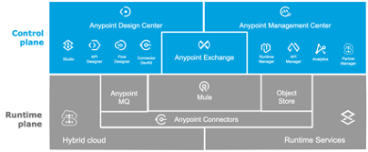

# Anypoint Platform

- [Anypoint Platform](#anypoint-platform)
    - [Anypoint Platform Licensed Capabilities](#anypoint-platform-licensed-capabilities)

# Anypoint Platform

The Anypoint Platform has five major components and will be the core to future integration capabilities:
- **Anypoint Design center**: Comprehensive tools to develop APIs and integrations faster and easier
- **Exchange**: Marketplace of API and integration assets, promotes reuse of pre-built connectors, templates, examples, and APIs 
- **Anypoint Management center**: Manage and monitor your applications across the platform in a single place
- **Mule runtime engine & services**: Single runtime for your Mule applications, easily configurable, performant, and deployable anywhere
- **Anypoint MQ**: Anypoint Cloud based messaging platform, to support asynchronous messaging use cases such as queueing and publish-subscribe with fully hosted and managed cloud-based Message Queues and Exchanges
- **Object Store**: Mechanism for storing arbitrary objects in MuleSoft using key-value pairs
- **Security**: Safeguard sensitive information with layers of protection
- **Anypoint Connectors**: Provide a means to connect to endpoints from your integration applications. Connectors fall into different categories.
    - **Community**: MuleSoft or members of the MuleSoft community write and maintain the Community connectors. Connectors built by the community or MuleSoft are generally open-source, although each package may vary. Partner-built connectors may not be open-source. Contact the partner directly for more information. You do not need any special account or license to use a Community connector
    - **MuleSoft Certified**: MuleSoft Certified connectors are developed by MuleSoft’s partners and developer community and are reviewed and certified by MuleSoft. For support, customers should contact the MuleSoft partner that created the MuleSoft Certified connector.
    - **Select**: MuleSoft maintains Select connectors. Connectors included in the open source Mule distribution can be used by everyone, however support is only included in an Anypoint Platform subscription.
    - **Premium**: MuleSoft maintains Premium connectors; you must have an active CloudHub Premium plan or an Enterprise subscription with an entitlement for the specific connector you wish to use.

## Anypoint Platform Licensed Capabilities

Current provision of the platform  [Titanium / Platinum / Gold] MuleSoft subscription, with the following license entitlements as of <Jan 1, 2022> 

- **Production Cores/vCores**: <4> 
- **Sandbox Cores/vCores**: <8>
- **Anypoint VPCs**: <4>
- **Anypoint VPNs**: <4>
- **Anypoint DLBs (Dedicated Load Balancer)**: <4>
- **Static IPs**: <8>
- **API Manager and Analytics**
- **Premium Connectors**
- **SAP** [<1> Production, and <2> non-production environments]

**Reference**: [Product Subscription Plans](https://www.mulesoft.com/prod-subscription-plans)