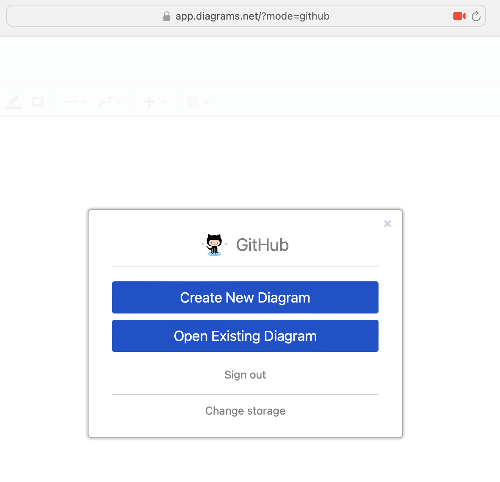
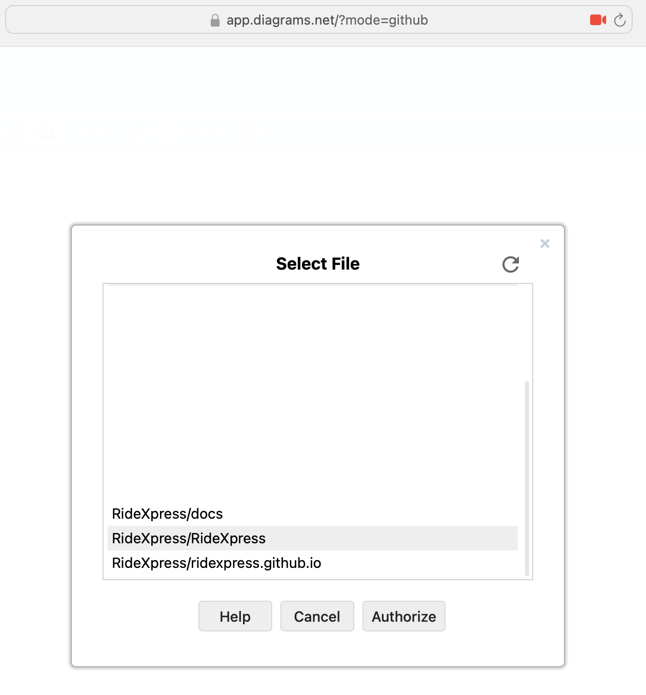
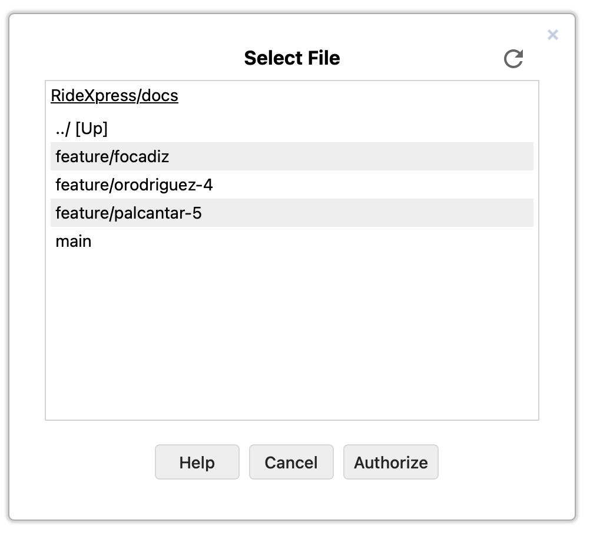
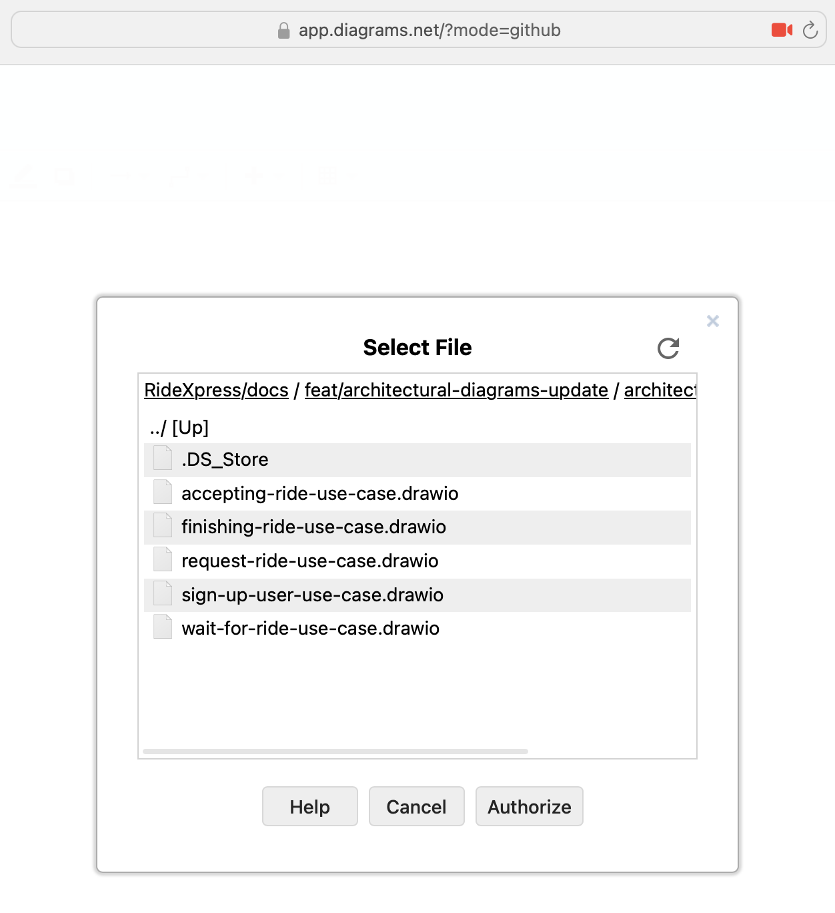

# How to open drawio files

1. Open https://draw.io?mode=github

2. Click on Open Existing Diagram

3. From the dialog select the branch

4. Select File

NOTE: In case you want to update a diagram, make sure you open it from a feature branch and open a Pull Request once the update is made
