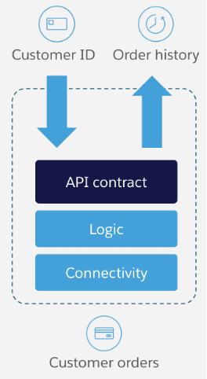

# Integration Architecture Specification

Note: document based of https://knowledgehub.mulesoft.com/s/article/Integration-Architecture-Specification

## Table of Contents
- [Introduction](#introduction)
    - [Key Business Drivers](#key-business-drivers)
    - [References](#references)
    - [Acronyms](#acronyms)
- [Solution Architecture](#solution-architecture)
    - [Integration Platform Capabilities](#integration-platform-capabilities)
        - [Patterns](#patterns)
        - [Connectivity](#connectivity)
        - [Technical Capabilities](#technical-capabilities)
- [Integration Catalog](#integration-catalog)
- [Mulesoft Integration Implementation](#mulesoft-integration-implementation)
    - [Mulesoft Anypoint Platform](#mulesoft-anypoint-platform)
    - [What is an API?](#what-is-an-api)
    - [Mulesoft Connectors](#mulesoft-connectors)
    - [API Application Catalogue](#api-application-catalogue)
    - [Reusable APIs](#reusable-apis)
- [Mulesoft Platform Reference Architecture](#mulesoft-platform-reference-architecture)
    - [Platform Capabilities](#platform-capabilities)
        - [Runtime Manager](#runtime-manager)
        - [API Manager](#api-manager)
        - [Design Center](#design-center)
        - [Exchange](#exchange)
        - [Connectors](#connectors)
        - [Platform Services](#platform-services)
            - [Anypoint Security](#anypoint-security)
            - [Virtual Private Cloud(VPC)](#virtual-private-cloud-vpc)
            - [Object Store](#object-store)
            - [Dedicated Load Balancers (DLB)](#dedicated-load-balancers-dlb)
        - [Extensibility](#extensibility)
    - [Platform Setup](#platform-setup)
        - [Deployment Regions](#deployment-regions)
        - [Business Groups](#business-groups)
            - [Organization](#organization)
            - [Organization Owner](#organization-owner)
            - [Business Groups Explained](#business-groups-explained)
            - [Business Group Structure](#business-group-structure)
        - [Environments](#environments)
    - [Platform Security](#platform-security)
        - [Access Management](#access-management)
        - [Identity Management](#identity-management)
        - [Platform Roles and Permissions](#platform-roles-and-permissions)
            - [Platform Role Types](#platform-role-types)
            - [Default Platform Roles & Permissions](#default-platform-roles-permissions)
    - [Proposed Deployment Architecture](#proposed-deployment-architecture)
        - [Environments](#environments-2)
        - [Dedicated Load Balancers](#dedicated-load-balancers)
        - [Virtual Private Clouds](#virtual-private-clouds)
        - [Virtual Private Networks](#virtual-private-networks)
    - [About MuleSoft, a Salesforce company](#about-mulesoft-a-salesforce-company)

## Introduction

This document describes the proposed integration architecture to support the RideXPress project. The integration solution is split into the following aspects:

- The proposed to-be logical integration processes and associated mechanisms for getting data into and out of the different systems that provide support to the RideXpress solution in a way that is agnostic of the integration layer; it is assumed that the integration platform supports all the required integration capabilities.
- The mechanism for functionally implementing these integration processes using MuleSoft as the integration platform.
- A proposed CloudHub-based platform reference architecture for deploying MuleSoft as the integration platform.

Note that any changes to ways of working as well as other organizational and operating model changes that are required to optimally deliver and maintain an integration platform whilst maximizing business agility are outside the scope of this document.

### Key Business Drivers
The key business drivers for this initiative that are relevant for the integration platform are as follows:

- Create an API driven company

### References

Please note that any version numbers are current as of the time of writing this document. Update this table of references to align with your integration architecture specifics.

- **Salesforce Platform REST API**: [Salesforce REST API Documentation](https://developer.salesforce.com/docs/atlas.en-us.api_rest.meta/api_rest/intro_what_is_rest_api.htm)
- **Authentication**: [Okta OAuth]()
- **API-led Connectivity**: [MuleSoft API-led Connectivity Whitepaper](https://www.mulesoft.com/lp/whitepaper/api/api-led-connectivity)
- **MuleSoft CloudHub**: [MuleSoft CloudHub Information](https://www.mulesoft.com/platform/saas/cloudhub-ipaas-cloud-based-integration)
- **Mulesoft Anypoint Platform**: [Mulesoft Enterprise Integration Platform](https://www.mulesoft.com/platform/enterprise-integration)
- **Mule Runtime**: [Mule Runtime Documentation](https://docs.mulesoft.com/mule-runtime/4.3/)
- **MuleSoft Salesforce Connector**: [MuleSoft Salesforce Connector Documentation](https://docs.mulesoft.com/salesforce-connector/10.9/)
- **Maps API**: [Google Maps]()
- **Payments API**: [Square]()
- **Data base**: 
- **Push Notifications API**: 
- **Email API**: 

### Acronyms

- **DB**: Data Base
- **MULE**: 

## Solution Architecture

TODO: Link to diagram

### Integration Platform Capabilities

The integration platform is presumed to encompass and facilitate a range of capabilities:

- **Connectivity:** Fundamental for linking various systems and applications.
- **API Design and Management:** Tools and protocols for creating and overseeing APIs.
- **Discovery and Reuse:** Mechanisms for identifying and repurposing existing assets.
- **Batch Processing:** Handling and processing of bulk data transactions. TODO: is this one valid? (I don't think so)
- **Monitoring:** Oversight of system health and transaction flow.
- **Enterprise Security:** Protocols and measures to safeguard data and interactions.

### Patterns

The Integration Platform is expected to support the following patterns, tailored to meet specific connectivity needs:

- **Synchronous Request-Reply:** A real-time, two-way communication pattern.
- **Fire and Forget:** Sending a message without waiting for a response.
- **Message with Asynchronous Callback:** A message is sent, and the response is handled independently from the initial request.
- **Messaging Publish-Subscribe:** Distributing messages to multiple recipients through a subscription model.
- **Process Orchestration:** Coordinating various services and processes into a cohesive workflow.
- **Reliable Messaging:** Zero tolerance for message loss. Even if the message is received from a nontransactional connector.

### Connectivity
This document presumes that the Integration Platform will provide support for the following connectivity technologies:

- Salesforce
    - Platform Events
    - Streaming APIs
    - sObject CRUD operations
    - Bulk API
    - Composite API
- Database
    - Poll for changes plus CRUD operations
- SFTP
    - Poll, read, write, move operations
- Square REST API
    - CRUD operation
- Okta 
    - REST API for CRUD operation
    - Platform security OAuth configuration
- Google Maps
    - REST API for CRUD operation

### Technical Capabilities

In addition to the above, the integration platform is expected to support the following technical capabilities:

- Data mapping and transformation
- Support for a wide range of standard protocols including SOAP, REST
- Unit testing, including the ability to simulate external dependencies
- CI/CD integration for automated testing and deployment
- Support for full API lifecycle from conception to deployment
- Exchange API contracts with consumers to support API development
- Automatic generation of mock APIs
- Routing and orchestration
- Event logging and monitoring
- Analytics

## Integration Catalog

The Integration Catalog provides a high-level overview of the integration flows for the system.

TODO: Integration flow diagram

The catalog is structured to be driven by the inbound triggers, where a single integration flow will lead to outbound interactions with one or more target systems. It's important to note that multiple source systems can trigger the same integration flow.

### Table of Main Integration Use Cases

| Name                                  |  | | Comments                                                                                     |
|---------------------------------------|------------------|------------------------------------------------|----------------------------------------------------------------------------------------------|
| User sign up                     | | |
| Request ride|   |                                        |
| Accepting ride| |                                                                                              |
| Wait for ride| |
| Finish ride||

#### User sign up 

- Description: As a user I want the ability to sign up to the application using a Mobile App.
The app will send a verification code to the registered email and/or phone.
- Timeliness: Near real-time the first response, the email verification will depend on the user.
- Business Trigger: A new user trying to register in the platform.
- Source System(s): N/A

#### Request a ride

- Description: As a customer I want the ability to select a destination in the Mobile App and the App will show the price based on X criteria and also the estimated arrival time.
- Timeliness: 
- Business Trigger: A new Ride is requestes by a customer.
- Source System(s): N/A
- Flow: 

#### Accepting ride

- Description: As a driver, I want the ability to accept or deny any inbound ride.
- Timeliness: 
- Business Trigger: A ride is accepted by a driver to be made.
- Source System(s): N/A

#### Wait for ride

- Description: As a customer I want the ability to see the location of the driver to know when it will be near my pick up location.
- Timeliness: 
- Business Trigger: N/A
- Source System(s): N/A

#### Finish ride

- Description: As a driver I want the ability to finish the drive and as a user, I want the ability to confirm the end of the trip by scanning a QR code, using an NFC, or some other method.
- Timeliness: 
- Business Trigger: A ride is finished, and the payment must be confirmed.
- Source System(s): N/A

## Mulesoft Integration Implementation
The key goal of the approach recommended by this document is to introduce reusable building blocks that can be reused both during the initial implementation as well as by future projects, resulting in reduced development effort.

API-led connectivity is a methodical way to connect data to applications through a series of reusable and purposeful modern APIs that are each developed to play a specific role – unlock data from systems, compose data into processes, or deliver an experience.

The API building block is a product that consists of functionality and simplicity required for the full lifecycle of APIs.  This lifecycle consists of the ability to compose the data and connect to any other source of data. And it must provide full visibility, security, governance right from design.
The diagram below illustrates the API-led connectivity approach composed of three main layers:

-	System APIs to unlock backend systems through a consistent contract, making use of our extensive connectivity 
-	Process APIs providing orchestration and transformation into business domain objects for greater agility and value creation and 
-	Experience APIs focused on rendering information specific to devices or consuming client applications

The value of this approach is enabling a flexible, agile architecture built for reuse and consumption, to speed up project delivery with built in governance and security.

### Mulesoft Anypoint Platform
The Anypoint Platform has five major components and will be the core to future integration capabilities:
-	Exchange: Marketplace of API and integration assets, promotes reuse of pre-built connectors, templates, examples, and APIs 
-	Design center: Comprehensive tools to develop APIs and integrations faster and easier
-	Mule runtime engine & services: Single runtime for your Mule applications, easily configurable, performant, and deployable anywhere
-	Management center: Manage and monitor your applications across the platform in a single place
-	Security: Safeguard sensitive information with layers of protection

### What is an API?

An API is comprised of the following three aspects:
1.	API Contract: Describes data formats, transport and protocols that are used to consume this API
2.	Logic: The implementation of the API, including data transformation, logical flow control, error handling, etc.
3.	Connectivity: Adapters for translating to external application interfaces, including protocol translation, data format transformation, security, etc.

### Mulesoft Connectors

To meet the connectivity requirements of this solution, the following MuleSoft Connectors will be used:
Adjust according to your solution context.
1.	Salesforce Connector (Platform Events, sObject CRUD operations)
    - Salesforce SOAP, REST, Bulk, Platform Events, and Streaming APIs
1.	Web Services:
    - SOAP
    - REST
1.	Database
1.	SFTP
1. Google Maps Connector
1. Okta Connector

### API Application Catalogue
A list of the proposed deployed API applications is provided below. Note that this list is based on the information provided during the discovery workshops and validated during playback sessions. A single deployed API application can support multiple aspects of the logical integrations as described in section 1 of this document.

To interpret this table, it is important to first understand the MuleSoft API-led Connectivity approach as described in section 2 and in more detail here:
https://www.mulesoft.com/lp/whitepaper/api/api-led-connectivity

| API Name     | Type (E/P/S) | Function (+ logical integration catalogue references) |
|--------------|--------------|------------------------------------------------------|
| okta-system-api  | System       | Provides the CRUD operations for users and support of the Authentication information and processes|
| square-system-api| System       | Provides the CRUD operations for Payments    |
| salesforce-system-api| System   | Provides the CRUD operations on Salesforce entities|
| google-maps-system-api  | System       | Provides the functionality to of geolocalization and to create the best routes between the driver and passangers, and for the ride|
| db-system-api  | System       | Provides the CRUD operations to store non sensitive information in the database |
| push-notifications-system-api  | System | Provides the notifications functionality with the drivers and passangers|
| email-system-api  | System       | Provides email sending functionality |
| request-ride-process-api  | Process | Contains the orchestration logic to request a ride|
| accept-ride-process-api  | Process | Contains the orchestration logic to request a ride  |
| waiting-ride-process-api  | Process | Contains the orchestration logic to accept a ride  |
| finish-ride-process-api  | Process | Contains the orchestration logic to finish a ride  |
| sign-up-user-process-api  | Process | Contains the orchestration logic of the sign up process  |
| mobile-experience-api  | Experience | Is the entry point of the operations for drivers and passangers|

### Reusable APIs
The following core APIs are proposed to maximize reuse:

This can be visualized in the following layered API-led network diagram:

## Mulesoft Platform Reference Architecture
In line with the customer’s cloud-first strategy, the MuleSoft integration platform will be provided by CloudHub. CloudHub is the platform as a service (PaaS) component of Anypoint Platform - a global, fully managed, multi-tenanted, secure, and highly available platform for APIs and integrations. A CloudHub deployment model provides the following benefits:

- Get continuous software updates, no complex hardware maintenance required
- Improve efficiency with multi-tenancy for applications and workers
- Enjoy a globally distributed architecture with 99.99% uptime
- Leverage out-of-the-box cloud security and compliance
- Control access based on complex organizational requirements

This section serves as an initial Platform Reference Architecture that will provide a scalable and performant foundational architecture for ongoing and future integration and API development. The architecture provides common reference specifically around the physical, security, and deployment aspects of the platform.

### Platform Capabilities

As per the diagram above, the MuleSoft Anypoint Platform capabilities can be categorised into high-level groups of capabilities, each of which are briefly described below with links to detailed product documentation.

#### Runtime Manager
Runtime Manager provides capabilities to:
- Deploy and manage all Mule Applications from one central location, regardless of where the applications are running
- Monitor applications and raise alerts based on the configurable criteria to detect events of interest
- View and control any Virtual Machine (VM) or Staged Event-Driven Architecture (SEDA) queues within the flows of your deployed applications (only when running on cloud).

See [Runtime Manager](https://docs.mulesoft.com/runtime-manager/) for additional information.

High Availability:
- High Availability through Servers, Server Groups and Clusters
- High Performance to hundreds of thousands of Transactions per second
- Vertical and horizontal scalability to hundreds of Mule Runtimes deployed in a highly distributed Hybrid Environment
- Automated Failover
- Message Persistence.

See [Managing Servers, Server Groups and Clusters](https://docs.mulesoft.com/runtime-manager/managing-servers) for additional information.

Monitoring Dashboards:
The platform’s monitoring capabilities provide the following capabilities:
- Visibility into integrations across your application network
- Event-driven alerts to identify abnormal behavior, e.g. error responses, thresholds exceeded, etc.
- API Function Monitoring to automatically check the health of individual APIs
- Feedback from Mule flows and components in an application network.

See [Monitoring](https://docs.mulesoft.com/monitoring/) for additional information.

Visualizer provides:
- Views of different aspects of an application network graph
- Navigate / explore an application network to support troubleshooting and architectural and policy compliance reviews.

See [Visualizer](https://docs.mulesoft.com/visualizer/) for additional information.

#### API Manager
API Manager provides capabilities to:
- Manage APIs through the configuration and application of multiple, ordered, out-of-the-box policies (e.g., Client ID enforcement, Header Injection, etc.)
- Create and apply Custom Policies to meet the specific needs of your enterprise (e.g. Security, Traffic Management, Throttling, Compliance, etc.)
- Manage API consumers (e.g., Authorization, individual Rate Limits, SLA application, etc.)
- Monitor and raise Alerts for individual APIs based on API-specific metrics.

See [API Manager](https://docs.mulesoft.com/api-manager/2.x/latest-overview-concept) for additional information.

#### Design Center
Design Center provides capabilities to:
- Design and implement APIs using either Anypoint Studio or Flow designer tools
- Automate API testing by using MUnit
- Integrate with multiple Source Code Management systems (SCM) such as Git, BitBucket, TFS, or Subversion
- Mock an API before it is built. This allows API consumers to start playing with the API under development and provide feedback.

See [Design Center](https://docs.mulesoft.com/design-center/) and [Anypoint Studio](https://docs.mulesoft.com/studio/7.6/) for additional information.

#### Exchange
Exchange provides capabilities to:
- Publish and discover reusable assets such as APIs, Mule Applications, Connectors as well as API or Application Templates
- Publish and discover reusable API Fragments such as Data Types and Traits
- Create and expose API Developer Portals that include an API Console to allow developers to understand what the API does and send requests to (a Mock / Sandbox version) of the API.

See [Anypoint Exchange](https://docs.mulesoft.com/anypoint-exchange/) for additional information.

#### Mule Runtime
The Mule Runtime is a lightweight Java-based engine that provides the following capabilities:
- Allows developers to connect applications together quickly and easily, enabling them to exchange data
- Enables the easy integration of existing systems, regardless of the different technologies that the applications use, including HTTP, Web Services, JMS, JDBC, and more
- Can be deployed anywhere, can integrate and orchestrate events in real time or in batch, and has universal connectivity (Anypoint Connectors).

See [Mule Runtime](https://docs.mulesoft.com/mule-runtime/4.3/) for additional information.

#### Connectors
Anypoint Connectors facilitate the integration of Mule Applications with third-party APIs and Systems, providing a means to access Web Services and Resources. Using Anypoint Connectors within Mule Applications allows for sending and receiving data over a protocol or using an API.
A large set of connectors is available for use and new connectors can be created using the Mule Java and XML SDKs.

See [Anypoint Connectors](https://docs.mulesoft.com/connectors/) and [Mule SDK](https://docs.mulesoft.com/mule-sdk/1.1/) for additional information.

#### Platform Services

##### Anypoint Security
The Anypoint Platform takes a layered approach to securing application networks and is split between platform security and API security.

The key capabilities of platform security include:
- Block unauthorized access to systems through Filters and Policies
- Prevent exposure of sensitive data with encryption and Digital Signatures
- Secrets Manager provides secure vaults for TLS certificates and keystores
- Control access to APIs with proven security standards like OAuth2, SAML or LDAP.

See [Anypoint Security](https://docs.mulesoft.com/anypoint-security/) for additional information.

The key capabilities of API security include:
- Securing application configuration properties
- Cryptography module
- FIPS 140-2 compliance support
- Integration with Spring security
- TLS configuration
- OAuth Authorization
- Secure Token Service

See [Securing Mule](https://docs.mulesoft.com/mule-runtime/4.3/securing) for additional information.

##### Virtual Private Cloud (VPC)
VPCs allow for securely partitioning networks and environments within CloudHub. The MuleSoft base subscription includes 2 VPCs, one VPC can be associated with multiple environments. Organizations typically have separate Production and non-Production VPCs, with only the Production environment in the Production VPC, and all other environments (Test, Sandbox, etc.) in the Non-production VPC.

See [Virtual Private Cloud](https://docs.mulesoft.com/runtime-manager/virtual-private-cloud) for additional information.

##### Cloud Messaging (Anypoint MQ)
Anypoint MQ provides capabilities to:
- Perform advanced asynchronous messaging scenarios such as queueing and publish-subscribe with fully hosted and managed cloud-based Message Queues and Exchanges
- FIFO queues to retain message ordering
- Consume and produce messages using REST APIs
- Supports different environments, Business Groups, and role-based access control (RBAC).

See [Anypoint MQ](https://docs.mulesoft.com/anypoint-mq/) for additional information.

##### Object Store
Mule Object Store v2 is a mechanism for storing arbitrary objects in Mule using key-value pairs. By using a Mule Object store, applications are decoupled from any specific persistence implementation, allowing you to choose or switch the implementation you want. Object Stores can be accessed either via the built-in connector or via a REST API. Note that entries are API-specific when accessed via the connector.

See [Mule Object Store](https://docs.mulesoft.com/object-store/) for additional information.

##### Dedicated Load Balancers (DLB)
DLBs provide capabilities to:
- Handle load balancing among the different CloudHub workers that run your application
- Define SSL configurations to provide custom certificates
- Optionally to enforce two-way SSL client authentication
- Configure proxy rules that map your applications to custom domains. This enables you to host your applications under a single domain.

See [CloudHub Dedicated Load Balancer](https://docs.mulesoft.com/runtime-manager/cloudhub-dedicated-load-balancer) for additional details.

#### Extensibility
The Anypoint Platform provides multiple extensibility mechanisms, e.g.:
- CI/CD automation using Jenkins, Puppet, Bamboo, Maven, Nexus, etc.
- Integration with external Identity and Access Management Systems such as Okta, PingFederate, MS ADFS, Azure AD, OpenIM and OpenId Connect
- Integration with external monitoring, log aggregation and analytics tools such as Splunk, Nagios, ELK, etc.
- Integration with external infrastructure operations tools such as Docker, Kubernetes and OpenShift (on-premises runtimes).

### Platform Setup
#### Deployment Regions
The Mule control plane region will be the default (US).
The default Mule Runtime region should be set to “east-us-1”.

#### Business Groups
Organization hierarchies can be defined in CloudHub to partition CloudHub resource allocations, security roles, environments, and API deployments. The root of the hierarchy is the Anypoint Platform Organization, the Business Group hierarchy sits underneath the root Organization. The Anypoint Platform’s Access Management capabilities allow the creation of a hierarchy of Business Groups to support fine grained configuration of access to individual resources.

The following sections describe the key features of the organizational platform account structure.

##### Organization
When you create an Anypoint Platform account, a master (or root) organization is created. The organization name is based on the ‘Company’ field in the initial Anypoint Platform signup form.

##### Organization Owner
The user who first signs up for an Anypoint Platform account is designated as the organization owner. This is not a role but an identifier for this single user, who is assigned the Organization Administrators role by default. 

Organization Administrators can view and configure properties for an organization.

##### Business Groups Explained
Business Groups are also referred to as organizations (or sub organizations). Business Groups reside within the master organization and can contain their own Business Groups. Thus, the master organization and its Business Groups are organized in a hierarchical tree, where the master organization is the root. Each Business Group has one direct parent and can have multiple children, e.g.:

The organization administrator is also the administrator of all Business Groups within the account’s organization hierarchy.
##### Business Group Structure
The following initial Business Group structure is recommended:

#### Environments

APIs are deployed to Environments; Environments belong to a single Business Group. Anypoint Platform defines three Environment Types:
1.	Design: Enables API designers to test and run applications at design time. This environment type is used exclusively for APIs developed using Flow Designer within Design Center and consumes Design vCore allocations
1.	Sandbox: Provides useful environments for development and testing and enables you to safely test an application without affecting the production environment. Environments of this type consume Pre-Production resource allocations
1.	Production: The production environment where you can deploy applications and APIs. Environments of this type consume Production resource allocations.
The following environments will be created in the RideXPress Business Group:

| Environment name | Environment Type|
|------------------|-----------------|
| dev              | Sandbox (Non-production)|
| test             | Sandbox (Non-production)|
| prod             | Production|  

As stated previously, roles can be applied at the master organization level as well as at the business group level. Within Business Groups some roles and permissions are valid for the entire organization (=all environments) like the API designer role, and some are only valid for a specific environment like the permissions for deploying and starting applications.

### Platform Security
#### Access Management
Anypoint Access Management enables Anypoint Platform users to implement and manage resources and assign users, roles, and permissions in a way that makes sense for their unique organizational structure. It facilitates safe testing by creating sandbox environments, restricts access to production, and inspects all resource usage via an audit log that can be queried.

Access Management provides the following Platform and Security capabilities:
- Federate access and delegate administration to Business Groups
- Assign users to predefined or custom roles with fine-grained permissions
- Isolate sandbox and production environments
- Query a comprehensive audit log of user interactions via UI or API
- Authenticate users and clients with external identity solutions.

#### Identity Management
The Anypoint Platform can be configured to use an external Identity Provider using one of the following Single Sign-On (SSO) standards:
- OpenID Connect: End-User identity verification by an authorization server including SSO
- SAML 2.0: Web-based authorization including cross-domain SSO.

The following diagram shows the high level SAML based identity management process:

See [External Identity](https://docs.mulesoft.com/access-management/external-identity) for further information on configuring external Identity Providers.

#### Platform Roles and Permissions
##### Platform Role Types
The Anypoint Platform provides two types of roles:
1. Default roles: roles that are created automatically when an organization or business group is created. These roles provide permissions and access to core functionality of Anypoint Platform. You can modify default roles by assigning users or other roles. However, you cannot delete a default role.
1. Custom roles: roles that a user can create, customize, and delete. You can assign users or roles to a custom role. You can also associate a custom role to a specific Anypoint Platform product. For example, you can create a custom role called Application Designer and assign that role to the Design Center application. This enables users assigned the Application Designer role to access the Design Center application.

Note that roles and permissions are specific to a Business Group.

See [Roles](https://docs.mulesoft.com/access-management/roles) for further information.

##### Default Platform Roles & Permissions
- **Organization Admin**: Enables a user to edit to all versions of all APIs, all registered applications, and all API Portals in the Anypoint Platform. Permits access to the Organization Administration page, where they can add and manage users and roles, view and edit organization details, access API Manager and manage Client Applications and API policies, access the client ID and client secret for the organization, and customize the theme of the Developer Portal. Members of the Organization Administrator role also inherit the role of API Creator by default.
- **API Creators**: Enables a user to create and manage API versions in the Anypoint Platform for APIs. Members of the API Creator role have the ability to add new APIs to the platform on the API administration page. This role does not grant privileges for Runtime Manager.
- **Portals Viewer**: Enables a user to view a list of the Private API Portals to which they have Portal Viewer permissions from the Developer Portal. They can also click to view those API Portals. The ability to view an API Portal does not automatically give a user access to the API.
- **API Versions Owner**: Enables a user to manage, delete, and deprecate any API in the organization. They can edit the portal of any API in the organization.
- **Audit Log Viewers**: Enables a user to access the UI for the Audit Log under Access Management.
- **CloudHub Admin**: Provides access to all Runtime Manager functionality.
- **Exchange Administrators**: Manage Exchange Portal Enables a user to manage Exchange Portals, including customization, manage assets, manage reviews.
- **Exchange Contributors**: Enables a user to contribute Exchange assets and manage versions.
- **Exchange Viewers**: Enables a user to view and consume Exchange assets.

### Proposed Deployment Architecture
#### Environments
As described previously, CloudHub has the following environment types:
1. Design
2. Sandbox (aka Non-production)
3. Production

The Design environment type is only used when building APIs using Flow Designer within Design Center and does not support custom VPCs, VPNs and DLBs hence will not be used by the dev, test, and prod environments. This document assumes the following configuration:

| Environment Name | Environment Type |
|------------------|------------------|
| prod             | Production       |
| test             | Sandbox (Non-production) |
| dev              | Sandbox (Non-production) |

#### Dedicated Load Balancers

MuleSoft recommends a pair of Dedicated Load Balancers per environment type, i.e., two for Production and two for Sandbox (Non-production). This provides clean separation and an additional layer of security between APIs that are exposed to external consumers (Experience APIs) and internal APIs (Process and System APIs).

This is illustrated in the diagram below:

#### Virtual Private Clouds
Two Virtual Private Clouds (VPCs) will be required - one for Production and one for Sandbox (Non-production). VPCs are required to support custom Dedicated Load Balancers (DLBs).

#### Virtual Private Networks
It is assumed that two Virtual Private Networks (VPNs) will be required for CloudHub to connect to on-premises systems, one for Production and one for Sandbox (Non-production).

### About MuleSoft, a Salesforce company

MuleSoft, provider of the world’s #1 integration and API platform, makes it easy to connect data from any system – no matter where it resides – to create connected experiences, faster. Thousands of organizations across industries rely on MuleSoft to realize speed, agility and innovation at scale. For more information, visit [MuleSoft](https://www.mulesoft.com).

*MuleSoft is a registered trademark of MuleSoft, LLC, a Salesforce company. All other marks are those of respective owners.*