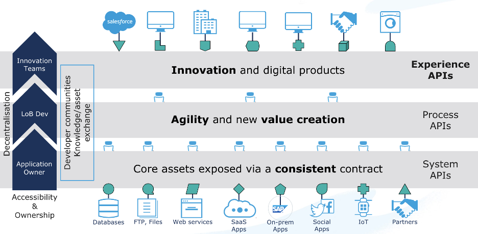
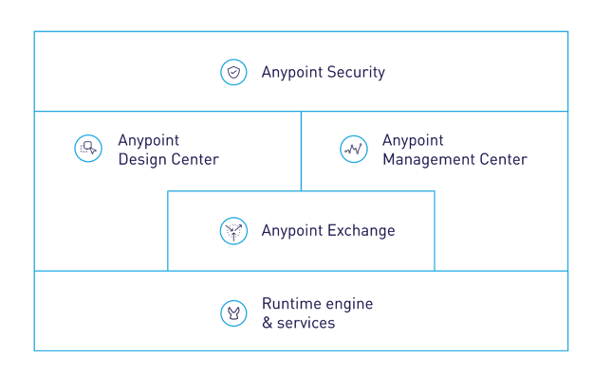
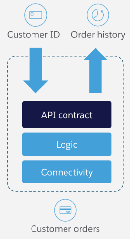

## Mulesoft Integration Implementation
The key goal of the approach recommended by this document is to introduce reusable building blocks that can be reused both during the initial implementation as well as by future projects, resulting in reduced development effort.

API-led connectivity is a methodical way to connect data to applications through a series of reusable and purposeful modern APIs that are each developed to play a specific role – unlock data from systems, compose data into processes, or deliver an experience.

The API building block is a product that consists of functionality and simplicity required for the full lifecycle of APIs.  This lifecycle consists of the ability to compose the data and connect to any other source of data. And it must provide full visibility, security, governance right from design.
The diagram below illustrates the API-led connectivity approach composed of three main layers:

-	System APIs to unlock backend systems through a consistent contract, making use of our extensive connectivity 
-	Process APIs providing orchestration and transformation into business domain objects for greater agility and value creation and 
-	Experience APIs focused on rendering information specific to devices or consuming client applications

The value of this approach is enabling a flexible, agile architecture built for reuse and consumption, to speed up project delivery with built in governance and security.

### Mulesoft Anypoint Platform
The Anypoint Platform has five major components and will be the core to future integration capabilities:
-	Exchange: Marketplace of API and integration assets, promotes reuse of pre-built connectors, templates, examples, and APIs 
-	Design center: Comprehensive tools to develop APIs and integrations faster and easier
-	Mule runtime engine & services: Single runtime for your Mule applications, easily configurable, performant, and deployable anywhere
-	Management center: Manage and monitor your applications across the platform in a single place
-	Security: Safeguard sensitive information with layers of protection

### What is an API?

An API is comprised of the following three aspects:
1.	API Contract: Describes data formats, transport and protocols that are used to consume this API
2.	Logic: The implementation of the API, including data transformation, logical flow control, error handling, etc.
3.	Connectivity: Adapters for translating to external application interfaces, including protocol translation, data format transformation, security, etc.

### Mulesoft Connectors

To meet the connectivity requirements of this solution, the following MuleSoft Connectors will be used:
Adjust according to your solution context.
1.	Salesforce Connector (Platform Events, sObject CRUD operations)
    - Salesforce SOAP, REST, Bulk, Platform Events, and Streaming APIs
1.	Web Services:
    - SOAP
    - REST
1.	Database
1.	SFTP
1. Google Maps Connector
1. Okta Connector

### API Application Catalogue
A list of the proposed deployed API applications is provided below. Note that this list is based on the information provided during the discovery workshops and validated during playback sessions. A single deployed API application can support multiple aspects of the logical integrations as described in section 1 of this document.

To interpret this table, it is important to first understand the MuleSoft API-led Connectivity approach as described in section 2 and in more detail here:
https://www.mulesoft.com/lp/whitepaper/api/api-led-connectivity

| API Name     | Type (E/P/S) | Function (+ logical integration catalogue references) |
|--------------|--------------|------------------------------------------------------|
| okta-system-api  | System       | Provides the CRUD operations for users and support of the Authentication information and processes|
| square-system-api| System       | Provides the CRUD operations for Payments    |
| salesforce-system-api| System   | Provides the CRUD operations on Salesforce entities|
| google-maps-system-api  | System       | Provides the functionality to of geolocalization and to create the best routes between the driver and passangers, and for the ride|
| db-system-api  | System       | Provides the CRUD operations to store non sensitive information in the database |
| push-notifications-system-api  | System | Provides the notifications functionality with the drivers and passangers|
| email-system-api  | System       | Provides email sending functionality |
| request-ride-process-api  | Process | Contains the orchestration logic to request a ride|
| accept-ride-process-api  | Process | Contains the orchestration logic to accept a ride  |
| waiting-ride-process-api  | Process | Contains the orchestration logic for waiting for a ride  |
| finish-ride-process-api  | Process | Contains the orchestration logic to finish a ride  |
| sign-up-user-process-api  | Process | Contains the orchestration logic of the sign up process  |
| cancel-ride-process-api  | Process | Contains the orchestration logic for ride cancellations (client and driver)  |
| driver-availability-process-api  | Process | Contains the orchestration logic for driver online/offline status management  |
| mobile-experience-api  | Experience | Is the entry point of the operations for drivers and passangers|

### Reusable APIs
The following core APIs are proposed to maximize reuse:

| Reusable API                     | Reused By                                                              | Description                                          |
|----------------------------------|------------------------------------------------------------------------|------------------------------------------------------|
| db-system-api                    | All process APIs                                                       | Central database access layer for all non-sensitive data storage and retrieval |
| okta-system-api                  | sign-up-user-process-api, mobile-experience-api                        | Authentication and user identity management across all user types (clients and drivers) |
| push-notifications-system-api    | request-ride-process-api, accept-ride-process-api, waiting-ride-process-api, finish-ride-process-api, cancel-ride-process-api | Push notification delivery to both clients and drivers across all ride lifecycle stages |
| square-system-api                | request-ride-process-api, finish-ride-process-api, cancel-ride-process-api, sign-up-user-process-api | Payment operations (hold, commit, refund) and customer management for both riders and driver payouts |
| google-maps-system-api           | request-ride-process-api, waiting-ride-process-api                     | Geolocation, route calculation, distance and ETA estimation |
| email-system-api                 | sign-up-user-process-api                                               | Email delivery for verification codes and account notifications |
| mobile-experience-api            | Client app, Driver app                                                 | Single entry point for all mobile app interactions; routes requests to appropriate process APIs |

**Key reuse principles:**
- System APIs are never called directly by the mobile app; they are always invoked through process APIs via the experience API.
- Each system API abstracts a single external system, enabling the external system to be replaced without affecting process or experience APIs.
- Process APIs encapsulate business logic and orchestration, calling multiple system APIs as needed.

This can be visualized in the following layered API-led network diagram:

