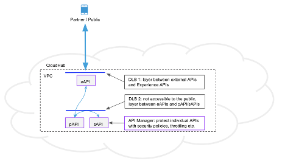

## Mulesoft Platform Reference Architecture
In line with the customer’s cloud-first strategy, the MuleSoft integration platform will be provided by CloudHub. CloudHub is the platform as a service (PaaS) component of Anypoint Platform - a global, fully managed, multi-tenanted, secure, and highly available platform for APIs and integrations. A CloudHub deployment model provides the following benefits:

- Get continuous software updates, no complex hardware maintenance required
- Improve efficiency with multi-tenancy for applications and workers
- Enjoy a globally distributed architecture with 99.99% uptime
- Leverage out-of-the-box cloud security and compliance
- Control access based on complex organizational requirements

This section serves as an initial Platform Reference Architecture that will provide a scalable and performant foundational architecture for ongoing and future integration and API development. The architecture provides common reference specifically around the physical, security, and deployment aspects of the platform.

### Platform Capabilities

As per the diagram above, the MuleSoft Anypoint Platform capabilities can be categorised into high-level groups of capabilities, each of which are briefly described below with links to detailed product documentation.

#### Runtime Manager
Runtime Manager provides capabilities to:
- Deploy and manage all Mule Applications from one central location, regardless of where the applications are running
- Monitor applications and raise alerts based on the configurable criteria to detect events of interest
- View and control any Virtual Machine (VM) or Staged Event-Driven Architecture (SEDA) queues within the flows of your deployed applications (only when running on cloud).

See [Runtime Manager](https://docs.mulesoft.com/runtime-manager/) for additional information.

High Availability:
- High Availability through Servers, Server Groups and Clusters
- High Performance to hundreds of thousands of Transactions per second
- Vertical and horizontal scalability to hundreds of Mule Runtimes deployed in a highly distributed Hybrid Environment
- Automated Failover
- Message Persistence.

See [Managing Servers, Server Groups and Clusters](https://docs.mulesoft.com/runtime-manager/managing-servers) for additional information.

Monitoring Dashboards:
The platform’s monitoring capabilities provide the following capabilities:
- Visibility into integrations across your application network
- Event-driven alerts to identify abnormal behavior, e.g. error responses, thresholds exceeded, etc.
- API Function Monitoring to automatically check the health of individual APIs
- Feedback from Mule flows and components in an application network.

See [Monitoring](https://docs.mulesoft.com/monitoring/) for additional information.

Visualizer provides:
- Views of different aspects of an application network graph
- Navigate / explore an application network to support troubleshooting and architectural and policy compliance reviews.

See [Visualizer](https://docs.mulesoft.com/visualizer/) for additional information.

#### API Manager
API Manager provides capabilities to:
- Manage APIs through the configuration and application of multiple, ordered, out-of-the-box policies (e.g., Client ID enforcement, Header Injection, etc.)
- Create and apply Custom Policies to meet the specific needs of your enterprise (e.g. Security, Traffic Management, Throttling, Compliance, etc.)
- Manage API consumers (e.g., Authorization, individual Rate Limits, SLA application, etc.)
- Monitor and raise Alerts for individual APIs based on API-specific metrics.

See [API Manager](https://docs.mulesoft.com/api-manager/2.x/latest-overview-concept) for additional information.

#### Design Center
Design Center provides capabilities to:
- Design and implement APIs using either Anypoint Studio or Flow designer tools
- Automate API testing by using MUnit
- Integrate with multiple Source Code Management systems (SCM) such as Git, BitBucket, TFS, or Subversion
- Mock an API before it is built. This allows API consumers to start playing with the API under development and provide feedback.

See [Design Center](https://docs.mulesoft.com/design-center/) and [Anypoint Studio](https://docs.mulesoft.com/studio/7.6/) for additional information.

#### Exchange
Exchange provides capabilities to:
- Publish and discover reusable assets such as APIs, Mule Applications, Connectors as well as API or Application Templates
- Publish and discover reusable API Fragments such as Data Types and Traits
- Create and expose API Developer Portals that include an API Console to allow developers to understand what the API does and send requests to (a Mock / Sandbox version) of the API.

See [Anypoint Exchange](https://docs.mulesoft.com/anypoint-exchange/) for additional information.

#### Mule Runtime
The Mule Runtime is a lightweight Java-based engine that provides the following capabilities:
- Allows developers to connect applications together quickly and easily, enabling them to exchange data
- Enables the easy integration of existing systems, regardless of the different technologies that the applications use, including HTTP, Web Services, JMS, JDBC, and more
- Can be deployed anywhere, can integrate and orchestrate events in real time or in batch, and has universal connectivity (Anypoint Connectors).

See [Mule Runtime](https://docs.mulesoft.com/mule-runtime/4.3/) for additional information.

#### Connectors
Anypoint Connectors facilitate the integration of Mule Applications with third-party APIs and Systems, providing a means to access Web Services and Resources. Using Anypoint Connectors within Mule Applications allows for sending and receiving data over a protocol or using an API.
A large set of connectors is available for use and new connectors can be created using the Mule Java and XML SDKs.

See [Anypoint Connectors](https://docs.mulesoft.com/connectors/) and [Mule SDK](https://docs.mulesoft.com/mule-sdk/1.1/) for additional information.

#### Platform Services

##### Anypoint Security
The Anypoint Platform takes a layered approach to securing application networks and is split between platform security and API security.

The key capabilities of platform security include:
- Block unauthorized access to systems through Filters and Policies
- Prevent exposure of sensitive data with encryption and Digital Signatures
- Secrets Manager provides secure vaults for TLS certificates and keystores
- Control access to APIs with proven security standards like OAuth2, SAML or LDAP.

See [Anypoint Security](https://docs.mulesoft.com/anypoint-security/) for additional information.

The key capabilities of API security include:
- Securing application configuration properties
- Cryptography module
- FIPS 140-2 compliance support
- Integration with Spring security
- TLS configuration
- OAuth Authorization
- Secure Token Service

See [Securing Mule](https://docs.mulesoft.com/mule-runtime/4.3/securing) for additional information.

##### Virtual Private Cloud (VPC)
VPCs allow for securely partitioning networks and environments within CloudHub. The MuleSoft base subscription includes 2 VPCs, one VPC can be associated with multiple environments. Organizations typically have separate Production and non-Production VPCs, with only the Production environment in the Production VPC, and all other environments (Test, Sandbox, etc.) in the Non-production VPC.

See [Virtual Private Cloud](https://docs.mulesoft.com/runtime-manager/virtual-private-cloud) for additional information.

##### Cloud Messaging (Anypoint MQ)
Anypoint MQ provides capabilities to:
- Perform advanced asynchronous messaging scenarios such as queueing and publish-subscribe with fully hosted and managed cloud-based Message Queues and Exchanges
- FIFO queues to retain message ordering
- Consume and produce messages using REST APIs
- Supports different environments, Business Groups, and role-based access control (RBAC).

See [Anypoint MQ](https://docs.mulesoft.com/anypoint-mq/) for additional information.

##### Object Store
Mule Object Store v2 is a mechanism for storing arbitrary objects in Mule using key-value pairs. By using a Mule Object store, applications are decoupled from any specific persistence implementation, allowing you to choose or switch the implementation you want. Object Stores can be accessed either via the built-in connector or via a REST API. Note that entries are API-specific when accessed via the connector.

See [Mule Object Store](https://docs.mulesoft.com/object-store/) for additional information.

##### Dedicated Load Balancers (DLB)
DLBs provide capabilities to:
- Handle load balancing among the different CloudHub workers that run your application
- Define SSL configurations to provide custom certificates
- Optionally to enforce two-way SSL client authentication
- Configure proxy rules that map your applications to custom domains. This enables you to host your applications under a single domain.

See [CloudHub Dedicated Load Balancer](https://docs.mulesoft.com/runtime-manager/cloudhub-dedicated-load-balancer) for additional details.

#### Extensibility
The Anypoint Platform provides multiple extensibility mechanisms, e.g.:
- CI/CD automation using Jenkins, Puppet, Bamboo, Maven, Nexus, etc.
- Integration with external Identity and Access Management Systems such as Okta, PingFederate, MS ADFS, Azure AD, OpenIM and OpenId Connect
- Integration with external monitoring, log aggregation and analytics tools such as Splunk, Nagios, ELK, etc.
- Integration with external infrastructure operations tools such as Docker, Kubernetes and OpenShift (on-premises runtimes).

### Platform Setup
#### Deployment Regions
The Mule control plane region will be the default (US).
The default Mule Runtime region should be set to “east-us-1”.

#### Business Groups
Organization hierarchies can be defined in CloudHub to partition CloudHub resource allocations, security roles, environments, and API deployments. The root of the hierarchy is the Anypoint Platform Organization, the Business Group hierarchy sits underneath the root Organization. The Anypoint Platform’s Access Management capabilities allow the creation of a hierarchy of Business Groups to support fine grained configuration of access to individual resources.

The following sections describe the key features of the organizational platform account structure.

##### Organization
When you create an Anypoint Platform account, a master (or root) organization is created. The organization name is based on the ‘Company’ field in the initial Anypoint Platform signup form.

##### Organization Owner
The user who first signs up for an Anypoint Platform account is designated as the organization owner. This is not a role but an identifier for this single user, who is assigned the Organization Administrators role by default. 

Organization Administrators can view and configure properties for an organization.

##### Business Groups Explained
Business Groups are also referred to as organizations (or sub organizations). Business Groups reside within the master organization and can contain their own Business Groups. Thus, the master organization and its Business Groups are organized in a hierarchical tree, where the master organization is the root. Each Business Group has one direct parent and can have multiple children, e.g.:

The organization administrator is also the administrator of all Business Groups within the account’s organization hierarchy.
##### Business Group Structure
The following initial Business Group structure is recommended:

#### Environments

APIs are deployed to Environments; Environments belong to a single Business Group. Anypoint Platform defines three Environment Types:
1.	Design: Enables API designers to test and run applications at design time. This environment type is used exclusively for APIs developed using Flow Designer within Design Center and consumes Design vCore allocations
1.	Sandbox: Provides useful environments for development and testing and enables you to safely test an application without affecting the production environment. Environments of this type consume Pre-Production resource allocations
1.	Production: The production environment where you can deploy applications and APIs. Environments of this type consume Production resource allocations.
The following environments will be created in the RideXPress Business Group:

| Environment name | Environment Type|
|------------------|-----------------|
| dev              | Sandbox (Non-production)|
| test             | Sandbox (Non-production)|
| prod             | Production|  

As stated previously, roles can be applied at the master organization level as well as at the business group level. Within Business Groups some roles and permissions are valid for the entire organization (=all environments) like the API designer role, and some are only valid for a specific environment like the permissions for deploying and starting applications.

### Platform Security
#### Access Management
Anypoint Access Management enables Anypoint Platform users to implement and manage resources and assign users, roles, and permissions in a way that makes sense for their unique organizational structure. It facilitates safe testing by creating sandbox environments, restricts access to production, and inspects all resource usage via an audit log that can be queried.

Access Management provides the following Platform and Security capabilities:
- Federate access and delegate administration to Business Groups
- Assign users to predefined or custom roles with fine-grained permissions
- Isolate sandbox and production environments
- Query a comprehensive audit log of user interactions via UI or API
- Authenticate users and clients with external identity solutions.

#### Identity Management
The Anypoint Platform can be configured to use an external Identity Provider using one of the following Single Sign-On (SSO) standards:
- OpenID Connect: End-User identity verification by an authorization server including SSO
- SAML 2.0: Web-based authorization including cross-domain SSO.

The following diagram shows the high level SAML based identity management process:

See [External Identity](https://docs.mulesoft.com/access-management/external-identity) for further information on configuring external Identity Providers.

#### Platform Roles and Permissions
##### Platform Role Types
The Anypoint Platform provides two types of roles:
1. Default roles: roles that are created automatically when an organization or business group is created. These roles provide permissions and access to core functionality of Anypoint Platform. You can modify default roles by assigning users or other roles. However, you cannot delete a default role.
1. Custom roles: roles that a user can create, customize, and delete. You can assign users or roles to a custom role. You can also associate a custom role to a specific Anypoint Platform product. For example, you can create a custom role called Application Designer and assign that role to the Design Center application. This enables users assigned the Application Designer role to access the Design Center application.

Note that roles and permissions are specific to a Business Group.

See [Roles](https://docs.mulesoft.com/access-management/roles) for further information.

##### Default Platform Roles & Permissions
- **Organization Admin**: Enables a user to edit to all versions of all APIs, all registered applications, and all API Portals in the Anypoint Platform. Permits access to the Organization Administration page, where they can add and manage users and roles, view and edit organization details, access API Manager and manage Client Applications and API policies, access the client ID and client secret for the organization, and customize the theme of the Developer Portal. Members of the Organization Administrator role also inherit the role of API Creator by default.
- **API Creators**: Enables a user to create and manage API versions in the Anypoint Platform for APIs. Members of the API Creator role have the ability to add new APIs to the platform on the API administration page. This role does not grant privileges for Runtime Manager.
- **Portals Viewer**: Enables a user to view a list of the Private API Portals to which they have Portal Viewer permissions from the Developer Portal. They can also click to view those API Portals. The ability to view an API Portal does not automatically give a user access to the API.
- **API Versions Owner**: Enables a user to manage, delete, and deprecate any API in the organization. They can edit the portal of any API in the organization.
- **Audit Log Viewers**: Enables a user to access the UI for the Audit Log under Access Management.
- **CloudHub Admin**: Provides access to all Runtime Manager functionality.
- **Exchange Administrators**: Manage Exchange Portal Enables a user to manage Exchange Portals, including customization, manage assets, manage reviews.
- **Exchange Contributors**: Enables a user to contribute Exchange assets and manage versions.
- **Exchange Viewers**: Enables a user to view and consume Exchange assets.

### Proposed Deployment Architecture
#### Environments
As described previously, CloudHub has the following environment types:
1. Design
2. Sandbox (aka Non-production)
3. Production

The Design environment type is only used when building APIs using Flow Designer within Design Center and does not support custom VPCs, VPNs and DLBs hence will not be used by the dev, test, and prod environments. This document assumes the following configuration:

| Environment Name | Environment Type |
|------------------|------------------|
| prod             | Production       |
| test             | Sandbox (Non-production) |
| dev              | Sandbox (Non-production) |

#### Dedicated Load Balancers

MuleSoft recommends a pair of Dedicated Load Balancers per environment type, i.e., two for Production and two for Sandbox (Non-production). This provides clean separation and an additional layer of security between APIs that are exposed to external consumers (Experience APIs) and internal APIs (Process and System APIs).

This is illustrated in the diagram below:

#### Virtual Private Clouds
Two Virtual Private Clouds (VPCs) will be required - one for Production and one for Sandbox (Non-production). VPCs are required to support custom Dedicated Load Balancers (DLBs).

#### Virtual Private Networks
It is assumed that two Virtual Private Networks (VPNs) will be required for CloudHub to connect to on-premises systems, one for Production and one for Sandbox (Non-production).

### About MuleSoft, a Salesforce company

MuleSoft, provider of the world’s #1 integration and API platform, makes it easy to connect data from any system – no matter where it resides – to create connected experiences, faster. Thousands of organizations across industries rely on MuleSoft to realize speed, agility and innovation at scale. For more information, visit [MuleSoft](https://www.mulesoft.com).

*MuleSoft is a registered trademark of MuleSoft, LLC, a Salesforce company. All other marks are those of respective owners.*