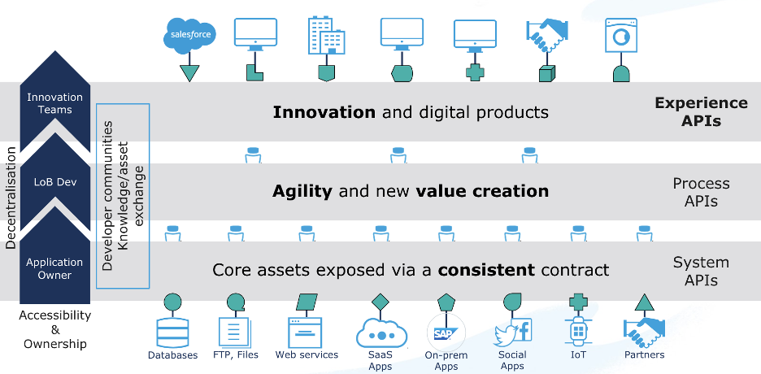
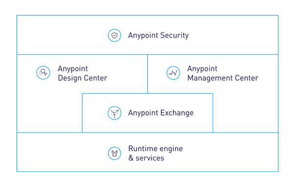
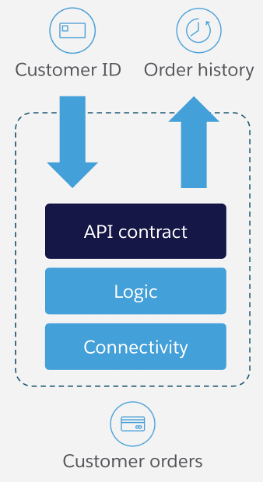

# Integration Architecture Specification

## Table of Contents
- [Introduction](#introduction)
    - [Key Business Drivers](#business-drivers)
    - [References](#references)
    - [Acronyms](#acronyms)
- [Solution Architecture](#solution-architecture)
    - [Integration Platform Capabilities](#integration-patform-capabilities)
        - [Patterns](#api-management)
        - [Connectivity](#connectivity)
        - [Technical Capabilities](#technical-capabilities)
- [Integration Catalog](#integration-catalog)
- [Mulesoft Integration Implementation](#mulesoft-integration-implementation)
    - [Mulesoft Anypoint Platform](#mulesoft-anypoint-platform)
    - [What is an API?](#what-is-an-api)
    - [Mulesoft Connectors](#mulesoft-connectors)
    - [API Application Catalogue](#api-application-catalogue)
    - [Reusable APIs](#reusable-apis)
- [Mulesoft Platform Reference Architecture](#mulesoft-platform-reference-architecture)
    - [Platform Capabilities](#platform-capabilities)
        - [Runtime Manager](#runtime-manager)
        - [API Manager](#api-manager)
        - [Design Center](#design-center)
        - [Exchange](#exchange)
        - [Connectors](#connectors)
        - [Platform Services](#platform-services)
            - [Anypoint Security](#anypoint-security)
            - [Virtual Private Cloud(VPC)](#virtual-private-cloud)
            - [Object Store](#object-store)
            - [Dedicated Load Balancers (DLB)](#)
        - [Extensibility](#)
    - [Platform Setup](#)
        - [Deployment Regions](#)
        - [Business Groups](#)
            - [Organization](#)
            - [Organization Owner](#)
            - [Business Groups Explained](#)
            - [Business Group Structure](#)
        - [Environments](#)
    - [Platform Security](#)
        - [Access Management](#)
        - [Identity Management](#)
        - [Platform Roles and Permissions](#)
            - [Platform Role Types](#)
            - [Default Platform Roles & Permissions](#)
    - [Proposed Deployment Architecture](#)
        - [Environments](#)
        - [Dedicated Load Balancers](#)
        - [Virtual Private Clouds](#)
        - [Virtual Private Networks](#)
    - [About MuleSoft, a Salesforce company](#)

Note: document based of https://knowledgehub.mulesoft.com/s/article/Integration-Architecture-Specification

## Introduction

This document describes the proposed integration architecture to support the RideXPress project. The integration solution is split into the following aspects:

- The proposed to-be logical integration processes and associated mechanisms for getting data into and out of the different systems that provide support to the RideXpress solution in a way that is agnostic of the integration layer; it is assumed that the integration platform supports all the required integration capabilities.
- The mechanism for functionally implementing these integration processes using MuleSoft as the integration platform.
- A proposed CloudHub-based platform reference architecture for deploying MuleSoft as the integration platform.

Note that any changes to ways of working as well as other organizational and operating model changes that are required to optimally deliver and maintain an integration platform whilst maximizing business agility are outside the scope of this document.

### Key Business Drivers
The key business drivers for this initiative that are relevant for the integration platform are as follows:

- Create an API driven company

### References

Please note that any version numbers are current as of the time of writing this document. Update this table of references to align with your integration architecture specifics.

- **Salesforce Platform REST API**: [Salesforce REST API Documentation](https://developer.salesforce.com/docs/atlas.en-us.api_rest.meta/api_rest/intro_what_is_rest_api.htm)
- **Authentication**: [Okta OAuth]()
- **API-led Connectivity**: [MuleSoft API-led Connectivity Whitepaper](https://www.mulesoft.com/lp/whitepaper/api/api-led-connectivity)
- **MuleSoft CloudHub**: [MuleSoft CloudHub Information](https://www.mulesoft.com/platform/saas/cloudhub-ipaas-cloud-based-integration)
- **Mulesoft Anypoint Platform**: [Mulesoft Enterprise Integration Platform](https://www.mulesoft.com/platform/enterprise-integration)
- **Mule Runtime**: [Mule Runtime Documentation](https://docs.mulesoft.com/mule-runtime/4.3/)
- **MuleSoft Salesforce Connector**: [MuleSoft Salesforce Connector Documentation](https://docs.mulesoft.com/salesforce-connector/10.9/)
- **Maps API**: [Google Maps]()
- **Payments API**: [Square]()
- **Data base**: 
- **Push Notifications API**: 
- **Email API**: 

### Acronyms

- **DB**: Data Base
- **MULE**: 

## Solution Architecture

TODO: Link to diagram

### Integration Platform Capabilities

The integration platform is presumed to encompass and facilitate a range of capabilities:

- **Connectivity:** Fundamental for linking various systems and applications.
- **API Design and Management:** Tools and protocols for creating and overseeing APIs.
- **Discovery and Reuse:** Mechanisms for identifying and repurposing existing assets.
- **Batch Processing:** Handling and processing of bulk data transactions. TODO: is this one valid? (I don't think so)
- **Monitoring:** Oversight of system health and transaction flow.
- **Enterprise Security:** Protocols and measures to safeguard data and interactions.

### Patterns

The Integration Platform is expected to support the following patterns, tailored to meet specific connectivity needs:

- **Synchronous Request-Reply:** A real-time, two-way communication pattern.
- **Fire and Forget:** Sending a message without waiting for a response.
- **Message with Asynchronous Callback:** A message is sent, and the response is handled independently from the initial request.
- **Messaging Publish-Subscribe:** Distributing messages to multiple recipients through a subscription model.
- **Process Orchestration:** Coordinating various services and processes into a cohesive workflow.
- **Reliable Messaging:** Zero tolerance for message loss. Even if the message is received from a nontransactional connector.

### Connectivity
This document presumes that the Integration Platform will provide support for the following connectivity technologies:

- Salesforce
    - Platform Events
    - Streaming APIs
    - sObject CRUD operations
    - Bulk API
    - Composite API
- Database
    - Poll for changes plus CRUD operations
- SFTP
    - Poll, read, write, move operations
- Square REST API
    - CRUD operation
- Okta 
    - REST API for CRUD operation
    - Platform security OAuth configuration
- Google Maps
    - REST API for CRUD operation

### Technical Capabilities

In addition to the above, the integration platform is expected to support the following technical capabilities:

- Data mapping and transformation
- Support for a wide range of standard protocols including SOAP, REST
- Unit testing, including the ability to simulate external dependencies
- CI/CD integration for automated testing and deployment
- Support for full API lifecycle from conception to deployment
- Exchange API contracts with consumers to support API development
- Automatic generation of mock APIs
- Routing and orchestration
- Event logging and monitoring
- Analytics

## Integration Catalog

The Integration Catalog provides a high-level overview of the integration flows for the system.

TODO: Integration flow diagram

The catalog is structured to be driven by the inbound triggers, where a single integration flow will lead to outbound interactions with one or more target systems. It's important to note that multiple source systems can trigger the same integration flow.

### Table of Main Integration Use Cases

| Name                                  |  | | Comments                                                                                     |
|---------------------------------------|------------------|------------------------------------------------|----------------------------------------------------------------------------------------------|
| User sign up                     | | |
| Request ride|   |                                        |
| Accepting ride| |                                                                                              |
| Wait for ride| |
| Finish ride||

TODO: add the MVP use cases

#### User sign up 

- Description: As a user I want the ability to sign up to the application using a Mobile App.
The app will send a verification code to the registered email and/or phone.
- Timeliness: Near real-time the first response, the email verification will depend on the user.
- Business Trigger: A new user trying to register in the platform.
- Source System(s): N/A
- Flow: TODO: Add diagram link

#### Request a ride

- Description: 
- Timeliness: 
- Business Trigger: 
- Source System(s): N/A
- Flow: 

#### Accepting ride

- Description: 
- Timeliness: 
- Business Trigger: 
- Source System(s): N/A
- Flow: TODO: Add diagram link

#### Wait for ride

- Description: 
- Timeliness: 
- Business Trigger: 
- Source System(s): N/A
- Flow: TODO: Add diagram link

#### Finish ride

- Description: 
- Timeliness: 
- Business Trigger: 
- Source System(s): N/A
- Flow: TODO: Add diagram link

## Mulesoft Integration Implementation
The key goal of the approach recommended by this document is to introduce reusable building blocks that can be reused both during the initial implementation as well as by future projects, resulting in reduced development effort.

API-led connectivity is a methodical way to connect data to applications through a series of reusable and purposeful modern APIs that are each developed to play a specific role – unlock data from systems, compose data into processes, or deliver an experience.

The API building block is a product that consists of functionality and simplicity required for the full lifecycle of APIs.  This lifecycle consists of the ability to compose the data and connect to any other source of data. And it must provide full visibility, security, governance right from design.
The diagram below illustrates the API-led connectivity approach composed of three main layers:

-	System APIs to unlock backend systems through a consistent contract, making use of our extensive connectivity 
-	Process APIs providing orchestration and transformation into business domain objects for greater agility and value creation and 
-	Experience APIs focused on rendering information specific to devices or consuming client applications

The value of this approach is enabling a flexible, agile architecture built for reuse and consumption, to speed up project delivery with built in governance and security.

### Mulesoft Anypoint Platform
The Anypoint Platform has five major components and will be the core to future integration capabilities:
-	Exchange: Marketplace of API and integration assets, promotes reuse of pre-built connectors, templates, examples, and APIs 
-	Design center: Comprehensive tools to develop APIs and integrations faster and easier
-	Mule runtime engine & services: Single runtime for your Mule applications, easily configurable, performant, and deployable anywhere
-	Management center: Manage and monitor your applications across the platform in a single place
-	Security: Safeguard sensitive information with layers of protection

### What is an API?

An API is comprised of the following three aspects:
1.	API Contract: Describes data formats, transport and protocols that are used to consume this API
2.	Logic: The implementation of the API, including data transformation, logical flow control, error handling, etc.
3.	Connectivity: Adapters for translating to external application interfaces, including protocol translation, data format transformation, security, etc.

### Mulesoft Connectors

To meet the connectivity requirements of this solution, the following MuleSoft Connectors will be used:
Adjust according to your solution context.
1.	Salesforce Connector (Platform Events, sObject CRUD operations)
    - Salesforce SOAP, REST, Bulk, Platform Events, and Streaming APIs
3.	Web Services:
    - SOAP
    - REST
4.	Database
5.	SFTP
6. Google Maps Connector
7. Okta Connector

### API Application Catalogue
A list of the proposed deployed API applications is provided below. Note that this list is based on the information provided during the discovery workshops and validated during playback sessions. A single deployed API application can support multiple aspects of the logical integrations as described in section 1 of this document.

To interpret this table, it is important to first understand the MuleSoft API-led Connectivity approach as described in section 2 and in more detail here:
https://www.mulesoft.com/lp/whitepaper/api/api-led-connectivity

| API Name	| Type (E/P/S)	| Function (+ logical integration catalogue references)||---------------------------------------|------------------|---------------------------------------|------------------|
| Okta | System | asdf |

### Reusable APIs

## Mulesoft Platform Reference Architecture
### Platform Capabilities
#### Runtime Manager
#### API Manager
#### Design Center
#### Exchange
#### Connectors
#### Platform Services
##### Anypoint Security
##### Virtual Private Cloud (VPC)
##### Object Store
##### Dedicated Load Balancers (DLB)
#### Extensibility

### Platform Setup
#### Deployment Regions
#### Business Groups
##### Organization
##### Organization Owner
##### Business Groups Explained
##### Business Group Structure
#### Environments

### Platform Security
#### Access Management
#### Identity Management
#### Platform Roles and Permissions
##### Platform Role Types
##### Default Platform Roles & Permissions

### Proposed Deployment Architecture
#### Environments
#### Dedicated Load Balancers
#### Virtual Private Clouds
#### Virtual Private Networks

### About MuleSoft, a Salesforce company