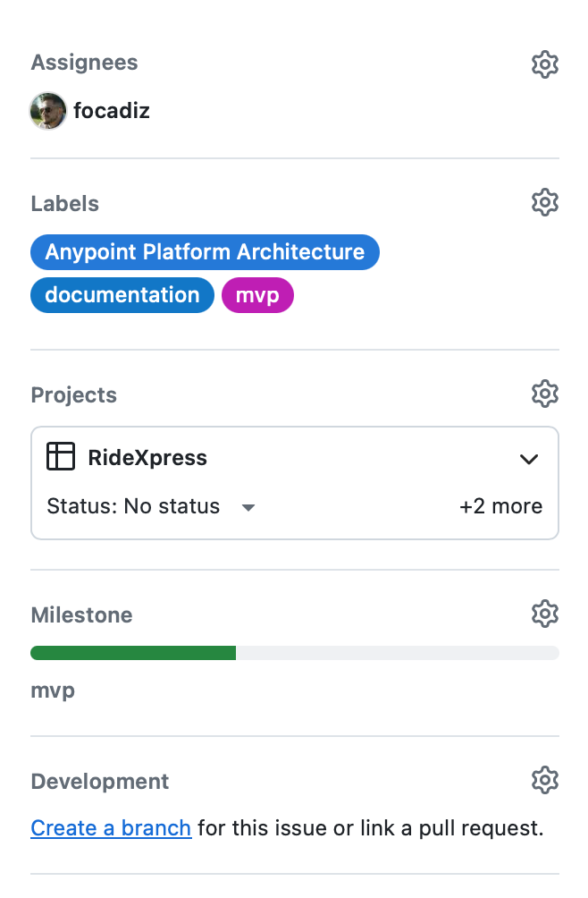
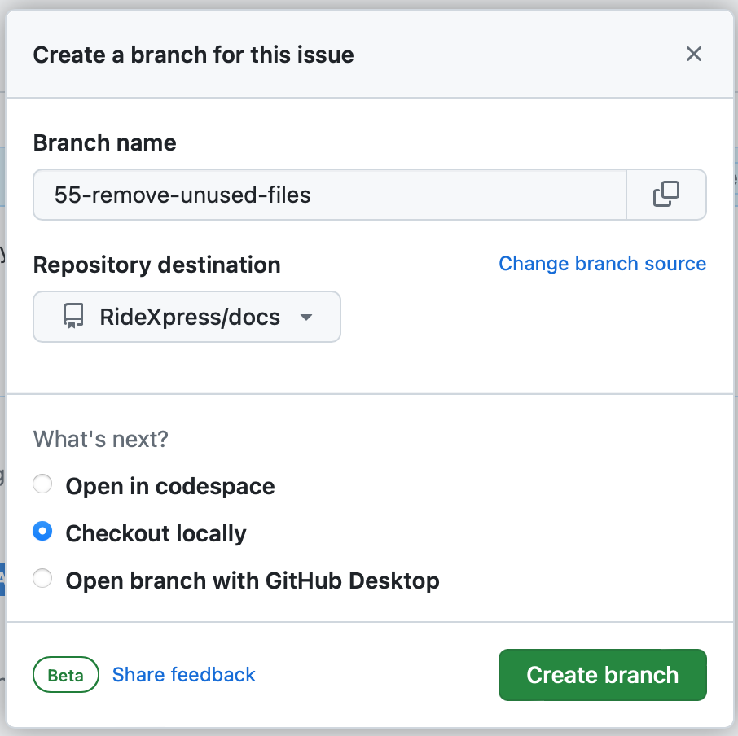
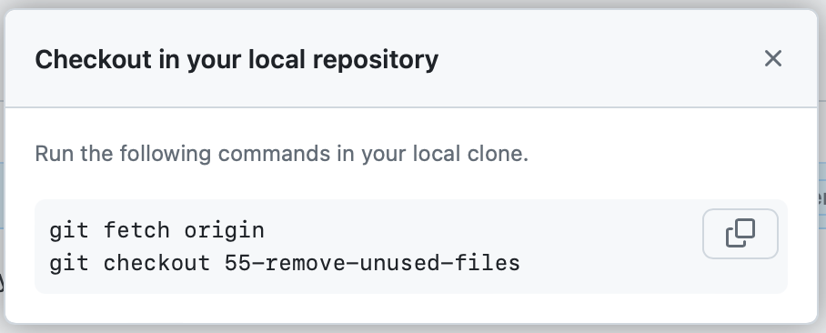

# Contributing

Thanks for your interest in RideXpress. We are continously looking to improve the project in different ways such as:  
- Fixing bugs
- Reviewing and updating documentation
- Coding new components
- Creating content for Meetups

I you would like to contribute please open an issue in this repo so the team can give you access to the GitHub team and Anypoint Platform.

Every contribution counts and every voice and opinion is valuable so we meet regularly to discuss several topics around Requirements, Architecture, Best practices and also experiences in general. We don't expect you to join to all the calls but catching up in a call has been very valuable for the team.

In general, we use Github issues to create working items we assign during the calls, we discuss the working items to get different perspectives around the solution but we can also help out in case you are learning and need additional support. Every issue should create a feature branch that will require at least one review from another teammate to be merged into the develop branches.

The practice we started using was to create feature branches directly from Github as follows:

From the issues page click on `Create branch`

That will open a dialog to create the remote branch. Use the default values and click on `Create branch`:

Copy and paste the following commands in your terminal (If you are not using a Desktop client):

# General Guidelines

In order to control our contributions and measure the project progress, the following guidelines should be used:

## Tasks:

A task is a minimum piece of work worked by a contributor, this task will have some metrics to keep them on track:

Size estimation: Contributors use points to estimate their issues with the following guidelines:
1 point is 2 hours of work, 2 points 4 hours of work, 3 and 5. 
A task shouldn't be long enough to be finished in multiple sprints, if that happens, the task should be split.
Complexity will be proportional to the amounts of points assigned but not strictly linked to the hours spent.

### Definition of done:
Every task should have detailed explanation of what needs to be accomplished of a task, the following can used as examples:

Define RAML object for user
Complete Design Document for Payments API
Deploy square-system-api
Write Unit tests for square-system-api
Implementation for square-system-api

The following status will be used: Todo, In Progress, In Review and Done.
Contributors need to update task status accordingly in the project.

## Sprints:

Every sprint will last two weeks.
In Github every sprint is a field of type iteration and someone from the team needs to create new sprints if needed.

Every developer should assign the task to the desired sprint.

## Progress meetings:

In order to maximize the time we spend working together, async communication would be preferred to talk about tasks progress, 
blockers or comments. Slack workflows is a great way to do it.

## Milestones

Milestones will be defined by larger components than tasks and will be defined by people/teams working on a functionality.

## Labels

To be able to find and measure tasks more easily, the following labels will be used:
- documentation
- api-design
- implementation
- test
- deploy
- ci-cd
- Labels specific for every project: ridexpress-experience-api, ridexpress-process-api,square-system-api, etc.
